# MySQL

## 설치

- Window

  [MySQL :: Download MySQL Installer](https://dev.mysql.com/downloads/installer/)

  **Windows (x86, 32-bit), MSI Installer / 428.3M** 
  <br><br>
  설명이 없는 부분은 **기본 설정**으로 한다.

  **#Step1**
  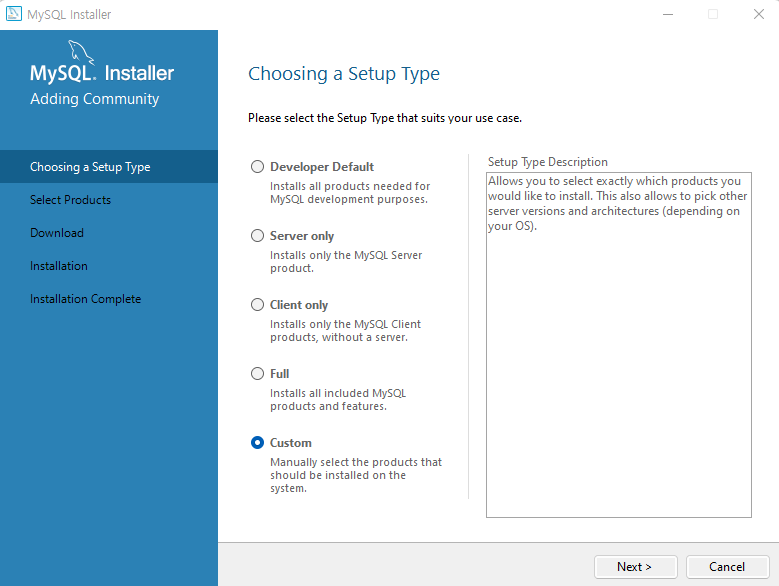<br><br>
  **#Step2**
  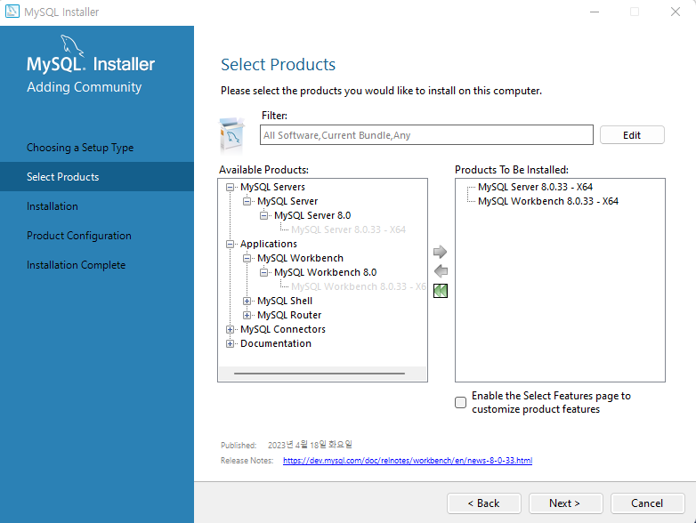<br><br>
  **#Step3**
  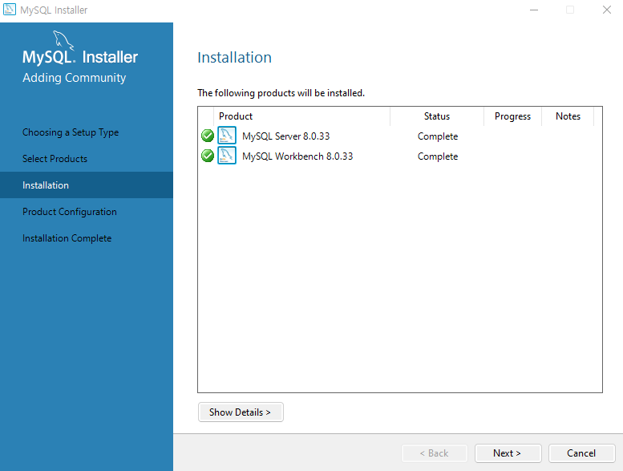<br><br>
  **#Step4**
  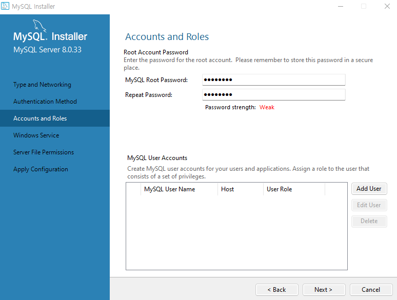<br><br>
  **#Step5**
  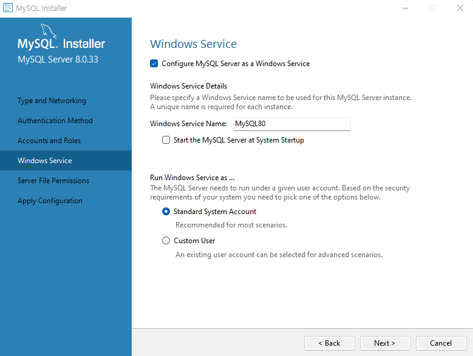<br><br>
  설치 후 에러가 생길 때 참고 링크

  [My sql workbench 에러해결](https://velog.io/@dongzooo/My-sql-workbench-에러해결-could-not-acquire-management-access-for-administration)

  [MySQL오류](https://yeo-story.tistory.com/entry/MySQL오류-SQL-Could-not-connect-server-may-not-be-running)


## 실행

- 데이터베이스 생성
    1. 새 스키마를 생성한다.

       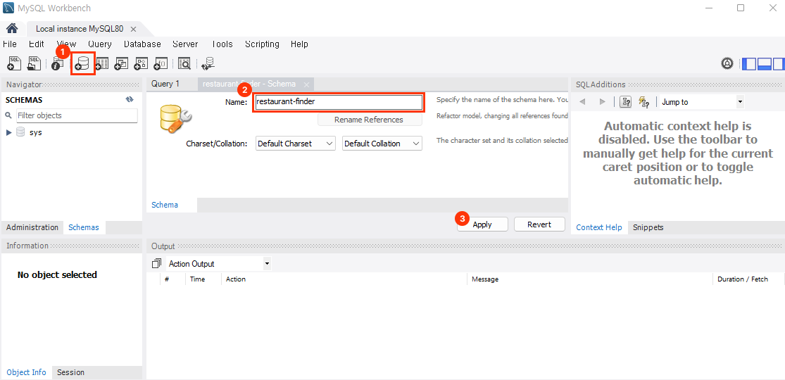<br><br>

    2. 스키마 네이밍을 데이터베이스로 바꾼 후 적용한다.

       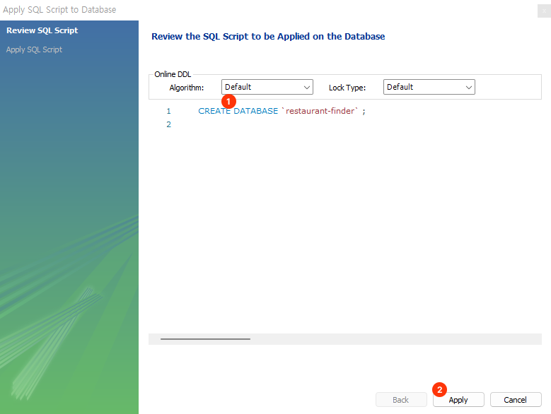<br><br>


- 테이블 생성 & 테이블 구조 만들기
    1. 새로운 테이블을 만들어서 컬럼을 작성한다.

       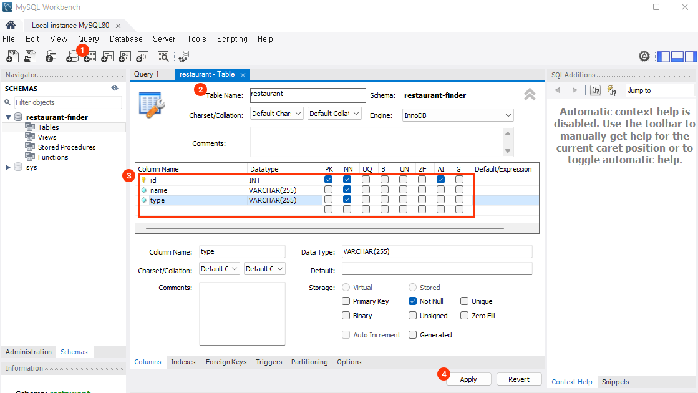

       [Datatype 정리](https://www.notion.so/Datatype-0628cc3dd6254348961e471a1702cf7d?pvs=21)

        <aside>
        💡 옵션 정리
        AI: 새로운 레코드를 추가할 때마다 자동으로 증가시킴
        PK: 중복 값을 저장할 수 없도록 보장
        NN: 필드가 항상 설정돼야 함을 의미

        </aside><br><br>

    2. 새로운 테이블과 컬럼이 만들어졌다.

       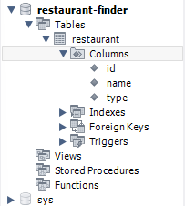<br><br>


- 테이블 데이터 삽입 & 선택
    <br><br>

    **데이터 삽입**
    
    새로운 파일을 생성하여 다음과 같이 적고 번개 모양을 클릭하면 아래 성공 여부가 뜬다

    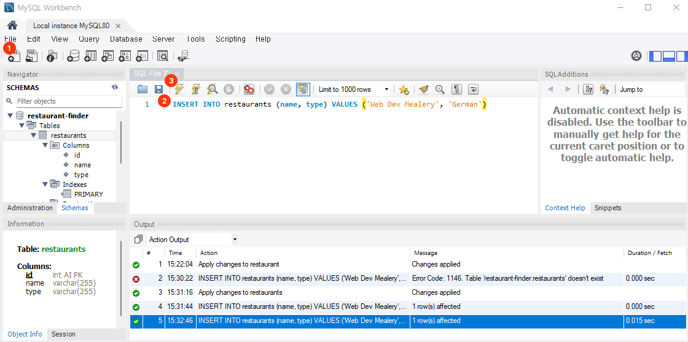<br><br>
    
    **데이터 선택**
    
    데이터 가져오는 것도 삽입과 동일한 과정을 거친다.
    
    - 전체 가져오기
        
        ```sql
        SELECT * FROM restaurants
        ```
    
    - 특정 조건 가져오기
        
        ```sql
        # 타입이 German
        SELECT * FROM restaurants WHERE type = 'German'
        
        # 타입이 German이며 이름의 시작이 W보다 위인 경우
        SELECT * FROM restaurants WHERE type = 'German' AND name > 'W'
        
        # 아이디와 이름만 가져오기
        SELECT id, name FROM restaurants
        
        # 조건을 충족하는 컬럼의 개수 가져오기
        SELECT COUNT(*) FROM restaurants WHERE type = 'German'
        ```


- 데이터 업데이트 & 삭제
    <br><br>

    **데이터 업데이트**
    
    ```sql
    # id가 1인 열의 name을 Web Dev Meals로 바꾸기
    UPDATE restaurants SET name = 'Web Dev Meals' WHERE id = 1
    ```
    
    **데이터 삭제**
    
    ```sql
    # id가 1인 열 삭제
    DELETE FROM restaurants WHERE id = 1
    ```

- 데이터 관계 설정
    1. 관계를 가질 테이블을 생성하고 해당 테이블_id로 관계성을 가진다.

       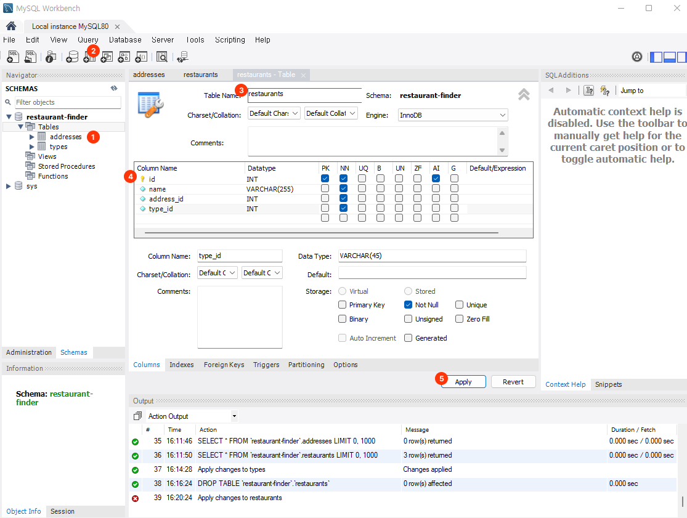<br><br>

    2. 테이블의 관계성을 갖기 위해 다음을 입력해준다.

        ```sql
        # SELECT * FROM [A 테이블] 
        # INNER JOIN [B 테이블] ON [A 테이블의 열] = [B 테이블의 열]
        
        SELECT restaurants.id, restaurants.name, addresses.*, types.name FROM restaurants
        INNER JOIN addresses ON (restaurants.address_id = addresses.id)
        INNER JOIN types ON (restaurants.type_id = types.id)
        ```