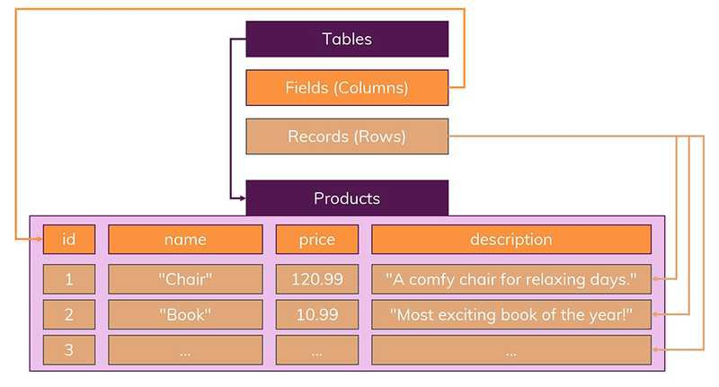
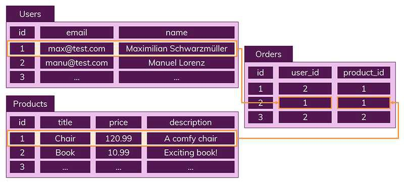
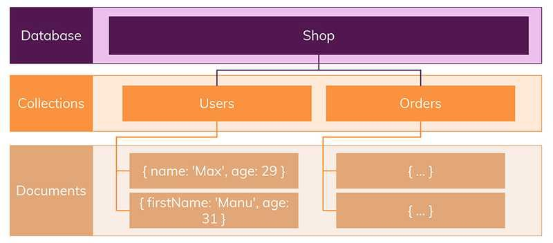
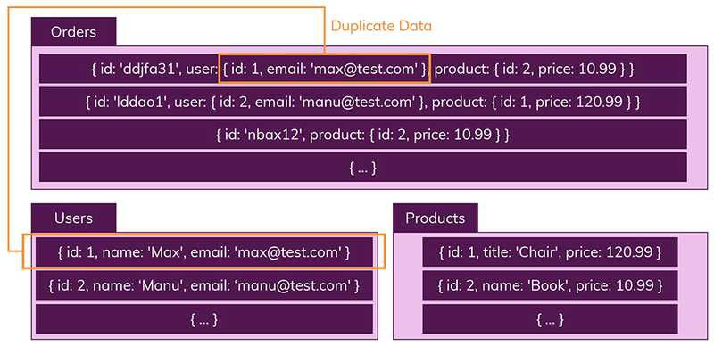

# SQL & NoSQL

## SQL (관계형 DB)

### 정의

Structured Query Language의 약자로 구조화된 쿼리 언어를 뜻한다고 알려져 있지만
원래는 Sequel이라 불렀으며 상표 문제로 SQL로 바뀌었다고 한다.

### DBMS

- [*MySQL*](https://www.mysql.com/)
- [*Oracle*](https://www.oracle.com/kr/)
- *[SQLite](https://www.sqlite.org/index.html)*
- *[MariaDB](https://mariadb.org/)*
- *[PostgreSQL](https://www.postgresql.org/)*

### 기능

RDBMS (관계형 데이터베이스 관리 시스템)에서 데이터를 저장, 수정, 삭제 및 검색 할 수 있다.

### 특징

1. 고정된 행(row)과 열(column)로 구성된 테이블에 데이터를 저장한다. 
   테이블의 구조와 데이터 타입 등을 사전에 정의한다. 
   그리고 테이블에 정의된 내용에 알맞은 형태의 데이터만 삽입할 수 있다.

   

2. 데이터는 관계를 통해 여러 테이블에 분산된다. 
   각 열은 하나의 속성에 대한 정보를 저장하고, 행에는 각 열의 데이터 형식에 맞는 데이터가 저장된다.

   

## NoSQL (비관계형 DB)

### 정의

관계형 데이터베이스를 뺀 나머지 유형을 총칭한다.

### DBMS

- Key-Value : *[Redis](https://redis.io/), [Dynamo](https://aws.amazon.com/ko/dynamodb/)*
- Document : *[MongoDB](https://www.mongodb.com/cloud/atlas)*
- Wide-Column Store : *[Cassandra](https://cassandra.apache.org/), [HBase](https://hbase.apache.org/)*
- Graph : *[Neo4J](https://neo4j.com/), [InfiniteGraph](https://objectivity.com/infinitegraph/)*

### 특징

1. 레코드를 documents(문서)라고 부르며 테이블을 collection(컬렉션)이라고 부른다.
2. 다른 구조의 데이터를 같은 컬렉션에 추가할 수 있다.
3. 문서는 JSON 데이터와 비슷한 형태를 가지고 있으며 데이터 구조에 대해 신경 쓰지 않아도 된다.
4. 일반적으로 관련 데이터를 동일한 컬렉션에 넣는다.

   

5. 데이터가 중복되기 때문에 불안정한 측면이 있다.

   