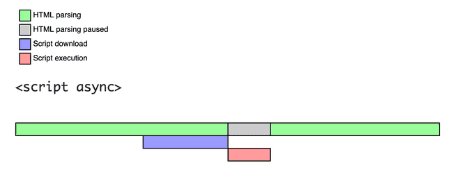
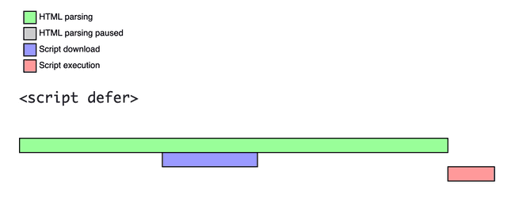

# 스크립트의 실행 시점을 조절하는 속성

##  스크립트를 비동기로 불러와야 하는 이유

1. 위치에 따라 스크립트의 동작 여부가 달라질 수 있다.

    ```html
    <script>
      // `null` 의 `innerHTML` 에 접근할 수 없으므로 에러가 발생합니다.
      console.log(document.getElementById("hello").innerHTML);
    </script>
    
    <div id="hello">안녕하세요</div>
    
    <script>
      // `안녕하세요` 가 출력됩니다.
      console.log(document.getElementById("hello").innerHTML);
    </script>
    ```

2. 스크립트 파일을 읽는 도중에는 DOM 파싱이 멈추기 때문에 용량이 큰 스크립트를 불러올 때는 HTML 문서가 제대로 보이지 않아 사용자의 부정적인 경험을 끼칠 수 있다.

    ```html
    <script src="jquery.js">
      // 대충 다운로드 받는 데 10초가 걸리는 JavaScript 파일
    </script>
    
    <!-- 아래의 엘리먼트는 JavaScript 파일을 모두 로드한 후에 렌더됩니다  -->
    <div id="hello">안녕하세요</div>
    ```

<hr>

##  방법

1. `<body>` 태그가 끝나는 부분에 `<script>`를 넣는다

   스크립트를 해석하는 도중에 사용자가 버튼을 클릭하거나 텍스트를 입력하는 것처럼 웹과 상호작용을 시도하게 된다면, 제대로 동작하지 않을 수도 있기 때문에 완벽한 해결책은 아니다.

2. `async` 스크립트 활용

   

    - 스크립트를 백그라운드에서 다운로드 한다. = DOM을 구성하는 동시에 스크립트를 불러올 수 있다.
    - HTML 페이지는 async 스크립트 다운이 완료되길 기다리지 않고 페이지 내 콘텐츠를 처리, 출력한다.
    - DOM이나 다른 스크립트에 의존성이 없고, 실행 순서가 중요하지 않은 경우에 사용
3. `defer` 스크립트 활용

   

    - 스크립트를 백그라운드에서 다운로드 한다.
    - HTML 파싱이 엄추지 않음
    - DOM이나 다른 스크립트에 의존성이 있고, 실행 순서가 중요한 경우에 사용
    - **모든 DOM이 로드된 후**에야 실행됨