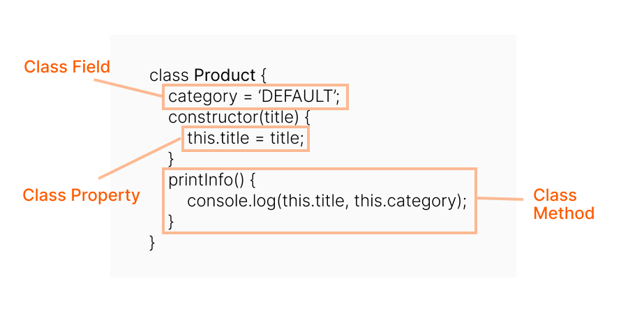
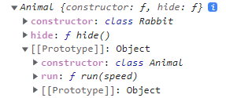

# [Class] 기본 문법 및 상속

## Class 기본 문법

### ✅ 클래스란?

```jsx
class User {
  constructor(name) { this.name = name; }
  sayHi() { alert(this.name); }
}

alert(typeof User); //function
```

class는 **함수**의 한 종류이다.

1. User라는 이름을 가진 함수를 만든 뒤 함수 본문은 생성자 메서드 constructor에서 가져온다. (생성자 메서드가 없으면 본문이 비워진 채로 함수가 만들어짐)
2. 클래스 내에서 정의한 메서드(sayHi)를 User.prototype에 저장한다.
3. new User를 호출해 객체를 만들고 객체의 메서드를 호출하면 저장된 prototype 프로퍼티를 통해 가져온다. 이러한 과정으로 객체에서 클래스 메서드에 접근할 수 있다.

```jsx
// 클래스는 생성자 메서드와 동일합니다.
alert(User === User.prototype.constructor); // true

// 클래스 내부에서 정의한 메서드는 User.prototype에 저장됩니다.
alert(User.prototype.sayHi); // alert(this.name);

// 현재 프로토타입에는 메서드가 두 개입니다.
alert(Object.getOwnPropertyNames(User.prototype)); // constructor, sayHi
```

함수의 종류이기 때문에 class 표현식과 class 선언 두 가지 방법을 사용할 수 있다.
클래스명의 첫 글자는 항상 **대문자**여야 한다.

```jsx
//class 표현식
const Rectangle = class { }; //class의 이름을 가질 수도 있고 갖지 않을 수도 있다.

//클래스 표현식에 이름을 붙이면 내부에서만 사용할 수 있다.
let User = class MyClass {
  sayHi() {
    alert(MyClass); // MyClass라는 이름은 오직 클래스 안에서만 사용할 수 있습니다.
  }
};

alert(MyClass); // ReferenceError: MyClass is not defined, MyClass는 클래스 밖에서 사용할 수 없습니다.
```

```jsx
//class 선언
class Polygon {}
```

클래스는 반드시 **정의 한 뒤에 사용**할 수 있다. 이유는 클래스가 호이스팅 될 때 초기화가 되지 않기 때문이다.

```jsx
const p = new Rectangle(); // ReferenceError
class Rectangle {}
```
<br>

### ✅ Constructor (생성자)

calss로 생성된 객체를 생성하고 초기화하기 위한 특수한 메서드이다.

객체의 기본 상태를 설정해주는 생성자 메서드 constructor는 클래스 안에 한 개만 존재할 수 있다. 또한 new에 의해 자동으로 호출되므로, 특별한 절차 없이 객체를 초기화 할 수 있다.

```jsx
class User {
  constructor(name) {
    this.name = name; //자동 호출 : 넘겨받은 인수 John을 name 변수에 할당한다.
  } //메서드 사이엔 쉼표가 없습니다.
  sayHi() {
    alert(this.name);
  }
}

let user = new User("John");
user.sayHi();
```
<br>

### ✅ getter / setter

리터럴을 사용해 만든 객체처럼 클래스도 getter나 setter, 계산된 프로퍼티(computed property)를 지원한다.

getter와 setter는 User.prototype에 정의된다.

```jsx
class User {
  constructor(name) {
    // setter를 활성화합니다.
    this.name = name;
  }
  get name() {
    return this._name;
  }
  set name(value) {
    if(!value) alert('이름을 입력해주세요')
    this._name = value;
  }
}

let user = new User("Tom");
console.log(user.name); // Tom
user = new User(""); // 이름을 입력해주세요
```
<br>

### ✅ 클래스 필드



클래스 필드 문법을 사용하면 어떤 종류의 프로퍼티도 클래스에 추가할 수 있다.

클래스 필드는 User.prototype이 아닌 개별 객체에만 클래스 필드가 설정된다.

```jsx
class User {
  name = "Tom";
}

let user = new User();
alert(user.name); // Tom
alert(User.prototype.name); // undefined
```
<br>

### ✅ 클래스에서의 this

this는 동적으로 결정되기 때문에 다른 컨텍스트에서 클래스를 호출하게 되면 this 메서드가 정의된 객체를 참조하지 않는다.

```jsx
class Button {
  constructor(value) {
    this.value = value;
  }
  click() {
    console.log(this.value);
  }
}

let button = new Button("Hello");
setTimeout(button.click, 1000); // undefined
```

이러한 형상을 잃어버린 this라고 하며 문제를 해결할 수 있는 방법은 두가지가 있다

```jsx
// 1. 래퍼 함수를 전달하기
setTimeout(() => button.click(), 1000);

// 2. 생성자 안 등에서 매서드를 객체에 바인딩하기
click = () => {
  console.log(this.value); 
}
```
<br>

## 클래스 상속

클래스 상속을 사용하면 클래스를 다른 클래스로 확장할 수 있다.

기존의 존재하던 기능을 토대로 새로운 기능을 만들 수 있다.

```jsx
class Animal {
  constructor(name) {
    this.speed = 0;
    this.name = name;
  }
  run(speed) {
    this.speed = speed;
    alert(`${this.name} 은/는 속도 ${this.speed}로 달립니다.`);
  }
}

let animal = new Animal("동물");
```

Animal 클래스를 만든 후 확장 문법 `class Child extends Parent`를 사용해 확장한다.

```jsx
class Rabbit extends Animal { //Animal을 상속받는 Rabbit
  hide() {
    alert(`${this.name} 이/가 숨었습니다!`);
  }
}

let rabbit = new Rabbit("흰 토끼");

rabbit.run(5); // 흰 토끼 은/는 속도 5로 달립니다.
rabbit.hide(); // 흰 토끼 이/가 숨었습니다!
```

상속받은 클래스는 해당 클래스의 메서드에서도 접근할 수 있고 상속을 준 메서드에도 접근할 수 있다.

키워드 extends는 프로토타입을 기반으로 동작한다. extends는 Rabbit.prototype.[[prototype]]을 Animal.prototype으로 설정한다.



console.log(Rabbit.prototype)의 결과

때문에 Rabbit.prototype에서 메서드를 찾지 못하면 Animal.prototype에서 메서드를 가져온다.

<br>

### ✅ [super] 오버라이딩

1. 메서드 오버라이딩

   부모 메서드를 토대로 일부 기능만 변경하고 싶을 때, 기능을 확장하고 싶을 때 super 키워드를 사용한다.

    ```jsx
    class Animal {
      constructor(name) {
        this.name = name;
      }
      speak() {
        console.log(`${this.name} makes a noise.`);
      }
      active() {
        return this.name
      }
    }
    
    class Lion extends Animal {
      speak() {
        super.speak(); //super을 사용하지 않으면 자체 메서드가 사용된다.
        console.log(`${this.name} roars.`);
      }
      active() {
        return super.active() + '은 어흥'
      }
    }
    
    let Lion = new Lion('Lion');
    Lion.speak();
    // Fuzzy makes a noise.
    // Fuzzy roars.
   
   Lion.active();
   // Lion은 어흥
    ```

2. 생성자 오버라이딩

   상속 받는 클래스의 생성자는 super()를 반드시 호출해야 한다. 그렇지 않으면 this가 정의되지 않는다.

    ```jsx
    class Animal {
      constructor(name) {
        this.speed = 0;
        this.name = name;
      }
    }
    
    class Rabbit extends Animal {
      constructor(name, earLength) {
        super(name); //super(...)는 this를 사용하기 전에 반드시 호출해야 한다.
        this.earLength = earLength;
      }
    }
    
    let rabbit = new Rabbit("흰 토끼", 10);
    ```