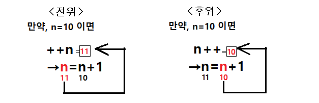

# 자료형 & 연산자

## 원시 값 타입

원시 값은 언어의 최고 로우레벨에서 표현되는 불변 데이터이다.

### Number

Number 타입은 숫자 외에도 +Infinity , -Infinity, NaN 세 개의 상징적인 값을 가진다.

어떤 숫자든 0으로 나누면 무한대가 나타난다.

```jsx
10 / 0 //Infinity
```

### BigInt

BigInt는 Number의 한계를 넘어서는 큰 정수도 안전하게 저장하고 연산 가능한 타입이다. 정수 리터럴 끝에 n을 붙이면 만들 수 있다. 암호 등의 이유로 아주 큰 숫자를 나타낼 때 쓰인다.

```jsx
2n ** 53n //9007199254740992n
```

### Undefined

값이 할당되지 않은 상태를 나타내며 변수에 할당도 가능하지만 가능한 직접 할당하는걸 권장하지 않는다.

```jsx
undefined + 10 //NaN
typeof undefined //undefined
```

### Null

변수를 재설정하거나 정리하고 싶을 때 사용하며 0이라는 숫자로 표현된다.

typeof null 의 결과는 object 이지만 언어 자체의 오류이므로 객체가 아니다.

```jsx
null + 10 //10
typeof null //object
```

### NaN

숫자 유형으로 분류되며 일종의 오류 코드. 숫자가 포함되지 않은 무언가로 계산할 경우 유효하지 않음을 나타냄

### Boolean

### String

### Symbol

고유하고 변경 불가능한 원시 값이며 객체의 속성을 키로 사용할 수 있다.

```jsx
const id1 = Symbol('id');
const id2 = Symbol('id');

console.log(id1 === id2) //false
```

<br>

## 표현식과 연산자

### 할당 연산자

연산과 할당을 동시에 할 수 있는 복합 할당 연산자도 있다.

| 이름 | 단축 연산자 | 뜻 |
| --- | --- | --- |
| 할당 | x = y | x = y |
| 더하기 할당 | x += y | x = x + y |
| 빼기 할당 | x -= y | x = x - y |
| 곱하기 할당 | x *= y | x = x * y |
| 나누기 할당 | x /= y | x = x / y |
| 나머지 할당 | x %= y | x = x % y |
| 거듭제곱 할당 | x **= y | x = x ** y |

### 비교 연산자

| 연산자 | 설명 |
|-----| --- |
| ==  | 피연산자가 서로 같을 경우 |
| !=  | 피연산자가 서로 다를 경우 |
| === | 두 피연산자의 값과 타입이 모두 같을 경우 |
| !== | 피연산자의 값 또는 타입이 서로 다를 경우 |
| \>  | 왼쪽 피연산자가 오른쪽 피연산자보다 클 경우 |
| \>= | 왼쪽 피연산자가 오른쪽 피연산자와 같거나 클 경우 |
| <   | 왼쪽 피연산자가 오른쪽 피연산자보다 작을 경우 |
| <=  | 왼쪽 피연산자가 오른쪽 피연산자와 같거나 작을 경우 |

비교 연산자는 유니코드 순으로 문자열을 비교할 수 있다.

```jsx
"B" > "A" //true
```

### 산술 연산자

| 연산자 | 설명 |
| --- | --- |
| % | 나머지 |
| ++ | 증가 |
| -- | 감소 |
| - | 부정 |
| + | 플러스 |
| ** | 거듭제곱 |

증감연산자는 전위(++n)와 후위(n++)로 나뉜다.

- 전위 연산자(++n, --n) : 먼저 증감 후에 해당 문장 실행
- 후위 연산자(n++, n--) : 해당 문장을 실행하고 증감




```jsx
let num = 10;

console.log(num++); //10
console.log(++num); //12
```

거듭제곱 연산자 a ** b 는 a를 b번 곱한 값이 반환된다.

```jsx
2 ** 4 //2*2*2*2 = 16
5 ** 3 //5*5*5 = 125
```

+ 연산자는 덧셈 기능과 문자열 접합을 제공할 수 있다.

```jsx
1 + '2' //'12'
```

### 비트 연산자

비트 연산자는 피연산자를 10진수, 16진수, 8진수 숫자로 취급하지 않고, 32개 비트의 집합으로 취급합니다. 예를 들어, 10진수 9는 2진수 1001로 나타냅니다. 비트 연산자는 이러한 이진법 표현에 대해 연산을 수행하지만, 반환할 땐 JavaScript 표준 숫자로 반환한다.

| 연산자 | 사용법 | 설명 |
| --- | --- | --- |
| 왼쪽 시프트 | a << b | a의 이진 표현을 b만큼 왼쪽으로 이동하고, 오른쪽은 0으로 채웁니다. |
| 오른쪽 시프트 | a >> b | a의 이진 표현을 b만큼 오른쪽으로 이동하고, 1 미만으로 이동한 비트는 버립니다. |

```jsx
2 << 10 //2048
2048 >> 10 //2
```

### 관계 연산자

`in` 연산자는 속성이 명시된 객체에 존재하면 true 를 반환한다.

```jsx
let color = ['red', 'blue'];
'red' in color //false (인덱스에 위치한 값이 아니라 인덱스 자체를 지정해야 함)
1 in color //true

'length' in Array //true
'hasOwnProperty' in Object //true
'toString' in Date //true
```

### 논리 연산자

| 연산자  | 사용법      | 설명                      |
|------|----------|-------------------------|
| &&   | A && B   | 둘 다 참일 때 true           |
| \|\| | A \|\| B | 둘 중 하나가 참일 때 true |
| ??   | A ?? B   | 둘 중 하나가 참일 때 true       |
| !    | !A       | true면 false를 false면 true |

```jsx
true && true && '도달 0' //'도달 0'
true && false && '도달 X' //false

false || false || '도달 0' //'도달 0'
true || true || '도달 X' //true
```
<br>

**??와 ||의 차이**

`||` 은 첫 번째 truthy 값을 반환한다.

`??` 은 첫 번째 정의된 값을 반환한다. 그리고 변수에 기본값을 할당하는 용도로 사용 가능하다.

기존 `||` 함수는 `0, null, undefined, “”` 모두 false로 간주되어  0과 “”값을 따로 줄 수 없었다. 때문에 이로인한 버그가 생길 우려가 있었다.

`??` 함수는 값이 `null, undefinded`일 때만 평가를 한다.

```jsx
const age = 0;

const userAge1 = age || 10; //10
const userAge2 = age ?? 10; //0
```

### 삼항 연산자

삼항 연산자는 **값 또는 식**을 반환해야 한다. 또한 숏코딩이 되는 것을 조심해야 한다.

```jsx
//[X] alert는 void를 반환하기 때문에 적합하지 않음
function alertMessage(isAdult) {
  isAdult ? alert("입장이 가능합니다.") : alert("입장이 불가능합니다.");
}

//[O] 값을 반환하도록 만든 예시
function alertMessage(isAdult) {
  return isAdult ? "입장이 가능합니다." : "입장이 불가능합니다.";
}

//[O] 삼항 연산자를 if문으로 변환
function alertMessage(isAdult) {
  if (isAdult) {
    alert("입장이 가능합니다.");
  } else {
    alert("입장이 불가능합니다.");
	}
}
```

```jsx
//[X] 과한 숏쿄딩으로 알아보기 어려움
function example() {
  return condition1
    ? value1
    : condition2
    ? value2
    : condition3
    ? value3
    : value4;
}

//[O] if문 대신 switch 문으로 수정이 용이하게 만듦
function example() {
  switch (key) {
    case condition1:
      value1;
      break;
    case condition2:
      value2;
      break;
    case condition3:
      value3;
      break;
    default:
      value4;
      break;
  }
}
```