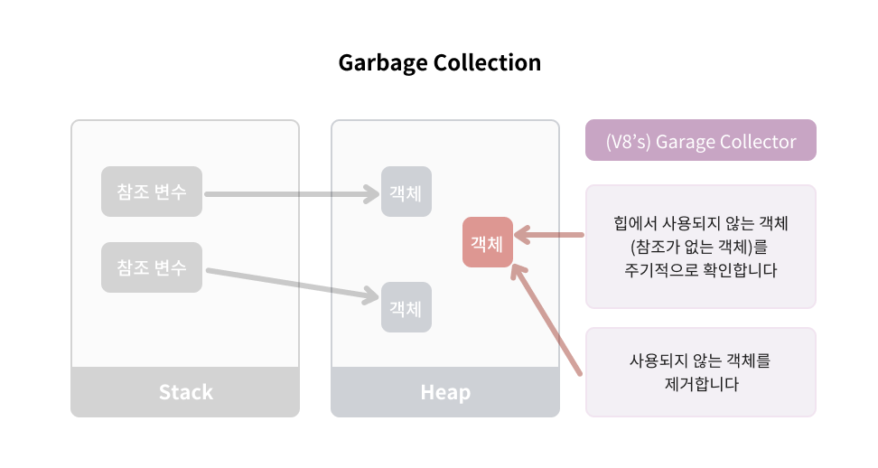

# 가비지 콜렉션, 컬렉터(Garbage Collection)



- 사용되지 않은 객체(참조되지 않은 객체)에 대한 힙 메모리를 주기적으로 확인하여 제거한다. (참조는 변수에 저장된 주소이다)
- 메모리 누수로 더이상 동작하지 않는 객체에 참조된 부분이 있다면 가비자 컬렉션을 진행할 수 없다.

    ```jsx
    function printMessage() {
        const value = messageInput.value;
        console.log(value || "Clicked me!");
    }
    
    function addListener() {
        clickableBtn.addEventListener("click", printMessage);
    }
    
    addListenerBtn.addEventListener("click", addListener);
    ```

  예를 들어 위와 같은 코드에서는

  `addListenerBtn`을 클릭하면 addListener()가 실행되고 `clickableBtn`을 클릭하면 printMessage()함수가 실행되는 절차를 가지고 있다.

  이 때 `clickableBtn` 버튼 하나 당 하나의 결과값이 나온다.<br><br>

  이와 같이 동작하는 이유는 버튼에 이벤트 리스너를 연결하여 이전에 사용한 함수를 호출하는 경우, JavaScript는 새로운 리스너를 만드는 대신에 기존 리스너를 새로운 리스너로 교체하기 때문이다.

  가비지 컬렉션이 없는 경우 아래처럼 같은 객체에 수백 개의 리스너가 연결될 수 있으며 메모리를 차지하게 된다.

    ```jsx
    function addListener() {
        clickableBtn.addEventListener("click", function () {
            const value = messageInput.value;
            console.log(value || "Clicked me!");
        });
    }
    
    addListenerBtn.addEventListener("click", addListener);
    ```

  `clickableBtn`를 클릭할 때마다 함수 객체가 즉석에서 만들어진다.

  때문에 `addListenerBtn`를 여러번 클릭하면 `clickableBtn`를 클릭 할 때 더 많은 결과값이 출력된다. `addEventListener`를 클릭 할 때마다 새로운 함수가 만들어지기 때문이다.

  이는 잠재적으로 문제가 될 수 있는 위험한 방식이다.