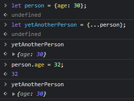

# 원시 값 & 참조 값

## 원시 값

> string, number, boolean, null, undefined, symbol

- 원시 값은 변수에 할당할 때 **실제 값이 저장**된다.
- 변수에 재할당 할 때 원시 값을 변경하는게 아닌 **새로운 메모리 공간을 확보하여 변수에 재할당** 하는 방식을 사용한다.
- 때문에 원시 값은 **변경 불가능한 값**이라고 할 수 있다. 한번 생성된 원시 값은 읽기 전용이기 때문이다.

## 참조 값

> Array, Object, Function

- 참조 값은 변수에 할당할 때 값 자체가 아닌 **메모리 주소**만 저장된다.
- 데이터의 불필요한 복제를 피하고 메모리가 차는 것을 방지하고 나은 성능을 제공하기 위함이다.
- 또한 재할당 없이 직접 객체나 배열에 접근하여 프로퍼티를 동적으로 추가, 갱신, 삭제가 가능하다.
- 때문에 참조 값은 **변경 가능한 값**이라고 할 수 있다.

### 참조 값 특징

- 전개연산자를 통한 복사

  
  
     
전개연산자를 통해 복사를 하면 객체의 키와 값을 모두 전달받아 새로 할당하기 때문에 주소가 아닌 값을 복사할 수 있다.

- 객체 비교

  

  서로 다른 두개의 변수에 각기 다른 메모리 주소를 저장했기 때문에 같은 데이터를 가지고 있다고 해도 둘은 완전히 다른 객체이다.

- const 안에서의 참조 값

  

  마찬가지로 변수에 저장된 것은 메모리 주소이다. push를 할 경우 메모리의 데이터를 조작하는 것이지 주소를 조작하는 것은 아니기 때문에 에러가 나지 않는다

  

  위와 같이 새로운 배열을 할당하는 경우 새로운 주소를 할당하기 때문에 에러가 난다. 이는 객체도 마찬가지이다.