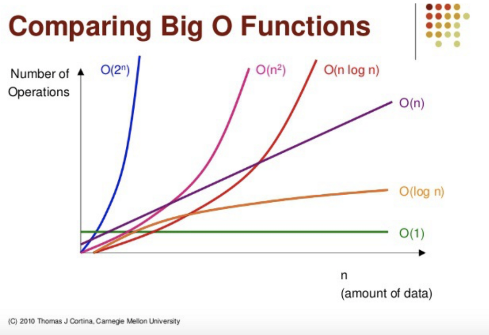

# 빅오
여러가지 코드를 서로 비교하고 성능을 평가하는 방법

### 빅오를 사용하는 이유

- 코드의 성능을 얘기할 때 정확한 전문용어를 사용하는 것이 중요하기 때문
- 여러 접근법의 장단점을 얘기할 때도 유용함
- 코드를 디버그 할 때 어떤 코드가 느린지 확인할 수 있음

### 빠른 코드 계산 방법

- 시간으로 계산할 경우 디바이스나 환경에 따라 다를 수 있다
- 따라서 이런 방식은 정확하지 않고 일일이 시간을 재야 하기 때문에 함수의 연산을 더하는 방식을 사용할 수 있다.

```jsx
//예제 1
function addUpTo(n) {
    let total = 0;
    for (let i = 1; i <= n; i++) {
        total += i;
    }
    return total;
}
```

```jsx
//예제 2
function addUpTo(n) {
    return n * (n + 1) / 2;
}
```

- 위와 같은 경우 예제1에서는 n 숫자에 따라 n이 5라면 연산자가 5개이고, n이 20이라면 연산자가 20개가 된다
- 반대로 예제 2는 연산자가 항상 3개이다.
- 계산 할 때 연산자의 정확한 갯수는 별로 중요하지 않고 **전체적인 추세**를 봐야 한다.

### 시간복잡도

```
- f(n) colude be liear (f(n) = n)
- f(n) colude be quadratic (f(n) = n²)
- f(n) colude be liear (f(n) = 1)
- f(n) colude be something entirely different!
```

```jsx
//O(n²) 방식
function rintAllPairs(n) {
    for (let i = 0; i <= n; i++) {
        for (let j = 0; j <= n; j++) {
            console.log(i,j);
        }
    }
}

//O(n) 방식
function addUpTo(n) {
    let total = 0;
    for (let i = 1; i <= n; i++) {
        total += i;
    }
    return total;
}

function logAtLeast5(n) {
    for (let i = 1; i <= Math.max(5, n); i++) {
        console.log(i)
    }
}

//O(1) 방식
function addUpTo(n) {
    return n * (n + 1) / 2;
}

function logAtLeast5(n) {
    for (let i = 1; i <= Math.min(5, n); i++) {
        console.log(i)
    }
}
```



### 공간복잡도

```jsx
function sum(arr) {
    let total = 0;
    for (let i = 0; i <= arr.length; i++) {
        total += arr[i];
    }
    return total;
}
```

- total이라는 변수가 하나 있고 i라는 두개의 변수가 있다.
- 새로운 변수를 만들지 않으므로 O(1) 공간이다.

```jsx
function double(arr) {
    let newArr = [];
    for (let i = 0; i <= arr.length; i++) {
        newArr.push(2 * arr[i]);
    }
    return newArr;
}
```

- newArr이란 새로운 배열에 arr 배열이 크기가 커질 수록 newArr에 들어가는 배열도 커지므로 O(n) 공간이라고 할 수 있다.