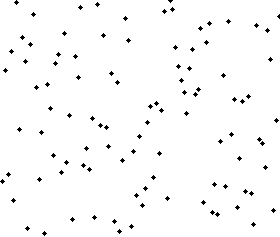
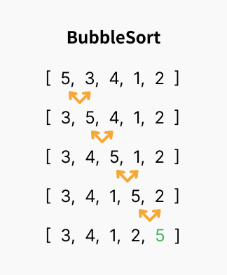

# 정렬 알고리즘

### 버블 정렬

<div style="display: flex; gap: 10px;">
    
    
</div>

- 시간 복잡도는 O(n)이다.
- 인접한 두 원소를 검사하여 정렬하는 알고리즘이다.
- 이름은 정렬 과정에서 원소의 이동이 거품이 수면으로 올라오는 듯한 모습을 보이기 때문에 지어졌다.
- 선택 정렬과 개념이 유사하다
- 오름차순으로 정렬할 때 첫번째 반복에 배열의 최대값이 맨 뒤로 이동한다.
- 반복을 거듭함에 따라 정렬해야 하는 항목 수가 감소한다.

```jsx
function bubbleSort(arr) {
    let noSwaps = true;
    for (let i = arr.length; i > 0; i--) {
        noSwaps = true;
        for (let j = 0; j < i - 1; j++) {
            if (arr[j] > arr[j + 1]) {
                [arr[j], arr[j + 1]] = [arr[j + 1], arr[j]];
                noSwaps = false;
            }
        }
        if (noSwaps) break;
    }
    return arr;
}

bubbleSort([85, 1, -3, 8, 45, 10]) //[-3, 1, 8, 10, 45, 85]
```
<br>

### 선택 정렬

- 시간복잡도는 O(n) = n^2이다.
- 버블 정렬과 비슷하지만 배열의 최소값이나 최대값을 **선택**해 데이터의 위치를 교환하는 차이점이 있다.

```jsx
function selectionSort(arr) {
    for (let i = 0; i < arr.length; i++) {
        let min = i;
        for (let j = i + 1; j < arr.length; j++) {
            if (arr[min] > arr[j]) min = j;
        }
        if (i !== min) {
            [arr[i], arr[min]] = [arr[min], arr[i]];
        }
    }
    return arr;
}
result(selectionSort([85, 1, -3, 8, 45, 10]));//[-3, 1, 8, 10, 45, 85]
```