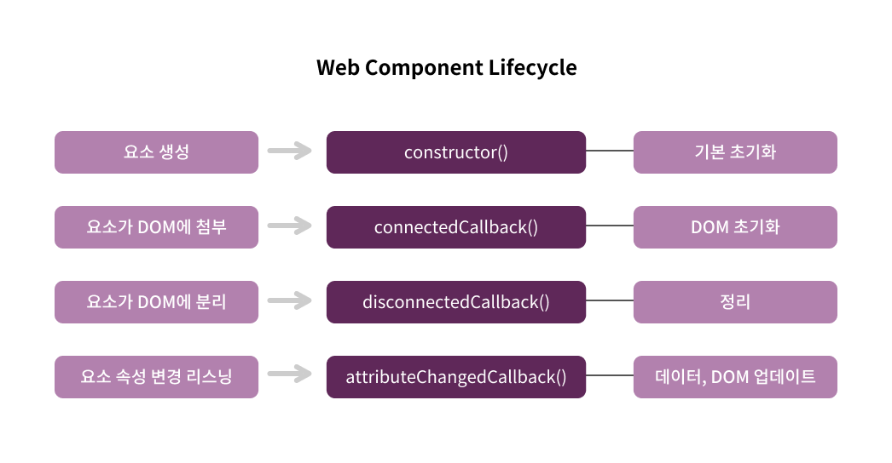
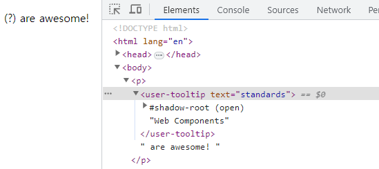
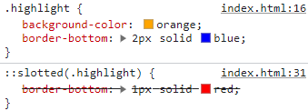

# Web Components

## 웹 컴포넌트

웹 컴포넌트는 자체 HTML 태그로 웹에 빌트인 된 태그가 아니라 브라우저에 빌트인 된 태그이다.

```jsx
<my-tooltip text="Extra Information">What?</my-tooltip>
```

이것은 JavaScript에서 정의한 HTML 태그로 페이지에서 사용할 수 있다.

웹 컴포넌트의 특성

1. 사용자 정의 HTML 요소
2. Shadow DOM

   자체 HTML 태그를 정의할 수 있도록 하며 메인 DOM과 일반 DOM과는 분리되어 있다.
   때문에 사용자 정의 요소에만 영향을 미칠 수 있는 CSS 스타일을 정의할 수 있다.

3. Template & Slots

<br>

### 1. 사용자 정의 태그 생성하기

```jsx
//tooltip.js
class Tooltip extends HTMLElement {
  constructor() {
    super();
    console.log("It is working!");
  }
}
customElements.define("user-tooltip", Tooltip);
```

사용자 정의 요소로 사용하기 위해 HTMLElement 클래스를 확장하여 생성해야 한다.

이때 constructor 내부에 super을 적어줘야 한다.

customElements는 사용자 정의 요소를 등록할 수 있도록 해주는 객체이다.

define 첫번째 인자는 HTML 태그를 정의하고 두번째 인자는 사용자 정의 요소를 위한 논리가 포함된 JavaScript 클래스를 넣는다.

<aside>
💡 사용자 정의 태그 네이밍 규칙
HTML 태그를 정의할 때 '-'를 사용하여 최소한 두 부분으로 나누어진 단어를 사용한다.
예를 들어 &lt;my-tooltip&gt;같은 경우인데 이를 &lt;tooltip&gt;으로 사용할 경우 기존 빌트인 된 HTML 태그와 혼돈이 올 수 있으므로 이렇게 사용한다.

</aside>

그 다음 HTML 파일에서 태그를 사용한다.

```html
<user-tooltip></user-tooltip> <!-- It is working! -->
```

이처럼 정의하면 HTML 파일에서 `<user-tooltip>`태그를 감지할 때마다 클래스를 인스턴스화하고 모든 논리를 사용하게 된다.

<br>

### 2. 웹 컴포넌트 라이프사이클

```html
<p><user-tooltip>Web Components</user-tooltip> are awesome!</p>
```

```jsx
//tooltip.js
class Tooltip extends HTMLElement {
  constructor() {
    super();
    const tooltipIcon = document.createElement("span");
    tooltipIcon.textContent = " (?)";
    this.appendChild(tooltipIcon);
  }
}
customElements.define("user-tooltip", Tooltip);
```

컴포넌트를 사용하기 위해 위와 같이 입력하면 아래와 같은 오류가 나타난다.

Uncaught DOMException: Failed to construct 'CustomElement': The result must not have children

이는 appendChild의 잘못된 위치 문제인데 이를 이해하기 위해서 웹 컴포넌트 라이프사이클을 알아야 한다.



위를 보면 요소가 생성되는 순간과 요소가 DOM에 첨부되는 순간이 다르다는 것을 알 수 있다.

1. 요소가 생성되는 순간에 호출되는 메서드는 constructor()이며 클래스 및 컴포넌트에서 사용하는 다양한 프로퍼티와 변수에 대한 기본 초기화에 유용하다.
2. 요소가 DOM에 첨부되고 호출되는 메서드는 connectedCallback()이다. DOM 초기화를 위한 단계이며 여기서 콘텐츠를 추가할 수 있고 DOM 엑세스를 시작할 수 있다.
3. 그 다음 웹 컴포넌트가 DOM에서 분리되면 disconnectedCallback()메서드가 호출되며 해당 노드를 파괴할 때 호출되므로 정리에 좋은 메서드라 할 수 있다.
4. attributeChangedCallback() 메서드는 컴포넌트에 전달되는 속성이 변경될 때  웹 컴포넌트의 데이터와 DOM을 업데이트하는 메서드이다.

따라서 코드를 다음과 같이 변경하면 오류 없이 컴포넌트 시작 부분에 (?)가 렌더링 되는 것을 볼 수 있다.

```jsx
//tooltip.js
class Tooltip extends HTMLElement {
  constructor() {
    super();
  }
  connectedCallback() {
    const tooltipIcon = document.createElement("span");
    tooltipIcon.textContent = " (?)";
    this.appendChild(tooltipIcon); //(?)Web Components are awesome!
  }
}
customElements.define("user-tooltip", Tooltip);
```

<br>

### 3. 컴포넌트 내에서 이벤트 리스닝

컴포넌트 내에서 이벤트 리스닝을 하는 방법은 아래를 참고하면 된다.

```jsx
//tooltip.js
class Tooltip extends HTMLElement {
  constructor() {
    ...
    this._tooltipContainer;
  }
  connectedCallback() {
    ...
    tooltipIcon.addEventListener("mouseenter", this._showTooltip.bind(this));
    tooltipIcon.addEventListener("mouseleave", this._hideTooltip.bind(this));
    ...
  }
  _showTooltip() {
    this._tooltipContainer = document.createElement("div");
    this._tooltipContainer.textContent = "default Tooltip text!";
    this.appendChild(this._tooltipContainer);
  }
  _hideTooltip() {
    this.removeChild(this._tooltipContainer);
  }
}
...
```

connectedCallback 메서드에서 생성한 요소에 addEventListener를 추가해 이벤트를 걸어준다.

이때 이벤트에 this를 잃어버리지 않도록 bind(this)를 해준다.

위의 _showTooltip, _tooltipContainer 등과 같이 밑줄을 앞에 붙이는 이유는 클래스 내부에서만 호출할 메서드와 변수라는 규칙을 가지고 있다.

<br>

### 4. 사용자 정의 태그 속성 사용하기

이벤트 리스닝으로 보여줬던 텍스트를 컴포넌트 태그 속성에서 받아오도록 바꿔보자

```html
<h2>
  <user-tooltip text="standards">Web Components</user-tooltip> are awesome!
</h2>
```

standards라는 텍스트를 받아오기 위해 아래와 같이 작성한다.

```jsx
//tooltip.js
class Tooltip extends HTMLElement {
  constructor() {
    ...
    this._tooltipText = "default Tooltip text!";
  }
  connectedCallback() {
    if (this.hasAttribute("text")) {
      this._tooltipText = this.getAttribute("text");
    }
    ...
  }
  _showTooltip() {
    ...
    this._tooltipContainer.textContent = this._tooltipText;
    ...
  }
}
...
```

this.getAttribute("text")를 connectedCallback 메서드에 적은 이유는 요소가 DOM에 추가된 후에 불러오는 메서드이기 때문에 DOM에 접근할 수 있어서이다.

이렇게 하면 text 속성이 없는 컴포넌트는 기본 default Tooltip text! 텍스트가 표시된다.

<br>

### 5. shadow DOM 사용하기

전역 스타일에 다음과 같이 스타일을 입히면 컴포넌트 또한 입혀져 있는 것을 볼 수 있다.

```html
<style>
  div {
    border: 3px solid orange;
  }
</style>
```

이유는 외부 DOM과 컴포넌트 DOM이 분리되지 않았기 때문인데 이를 분리하기 위해 다음과 같이 작성한다.

```jsx
//tooltip.js
class Tooltip extends HTMLElement {
  constructor() {
    ...
    this.attachShadow({ mode: "open" });
  }
  connectedCallback() {
    ...
    this.shadowRoot.appendChild(tooltipIcon);
  }
  _showTooltip() {
    ...
    this.shadowRoot.appendChild(this._tooltipContainer);
  }
  _hideTooltip() {
    this.shadowRoot.removeChild(this._tooltipContainer);
  }
}
...
```

attachShadow 모드를 open으로 정하고 (외부의 접근 허용에 관한 것인데 closed로 해도 접근할 수 있기 때문에 open으로 적는다)

아래 appendChild, removeChild 앞에 shadowRoot를 적어 경로를 다시 설정해준다.



코드를 입력한 뒤 새로고침 하면 위와 같이 shadow DOM을 볼 수 있다.

<br>

### 6. 탬플릿 정의하기

컴포넌트에서 스타일, 태그 템플릿을 정의할 때 innerHTML을 사용하면 된다.

```jsx
//tooltip.js
class Tooltip extends HTMLElement {
  constructor() {
    ...
    this.shadowRoot.innerHTML = `
        <style>
            div {
                background-color: black;
                color: white;
                position: absolute;
                z-index: 10;
            }
        </style>
        <slot>Some default</slot>
        <span> (?)</span>
    `;
  }
  connectedCallback() {
    ...
    const tooltipIcon = this.shadowRoot.querySelector("span");
    ...
  }
}
```

템플릿으로 기본 텍스트를 생성했기 때문에 기존에 tooltipIcon 요소 생성 코드를 지우고 span을 선택하게 바꾼다.

constructor에서 innerHTML을 사용할 수 있는 이유는 DOM에 엑세스하지 않고 DOM이 이용 가능해지면 사용할 콘텐츠를 준비하는 과정이라 가능하다.

또한 shadowDOM 덕분에 여기서의 스타일은 scope되어 해당 컴포넌트 내에서만 사용 가능하다.

<br>

### 7. slot 스타일링하기

innerHTML에 넣는 방법으로 slot을 스타일링 할 수 없다.

이유는 slot이 shadowDOM이 아닌 외부 즉, lightDOM에서 참조하는 것이기 때문이다.

```html
<style>
    .highlight{
      background-color: orange;
    }
</style>
<body>
    <p>
      <user-tooltip text="standards">
        <span class="highlight">Web Components</span>
      </user-tooltip>
      are awesome!
    </p>
</body>
```

위와 같이 클래스에 스타일을 주면 적용되는 것을 볼 수 있다.

```jsx
//tooltip.js
class Tooltip extends HTMLElement {
  constructor() {
    ...
    this.shadowRoot.innerHTML = `
        <style>
            .highlight{
                background-color: red;
            }
        </style>
    `;
  }
}
```

반대로 컴포넌트 내부에서 스타일을 줄 경우 적용이 되지 않는다.

slot은 shadowDOM이 아니기 때문이다.

컴포넌트 내부에서 slot을 스타일링 하기 위해 ::slotted() 선택자를 사용해야 한다. slotted 안에는 스타일링을 위한 태그나 CSS 선택자를 적어준다.

```jsx
//tooltip.js
class Tooltip extends HTMLElement {
  constructor() {
    ...
    this.shadowRoot.innerHTML = `
        <style>
            ::slotted(.highlight) {
                border-bottom: 1px solid red;
            }
        </style>
    `;
  }
}
```

참고로 컴포넌트 내부 외부에서 같은 스타일을 적용할 경우 내부 > 외부 순으로 오버라이딩 된다.



<br><br>

### 8. 컴포넌트 스타일링하기

`<user-tooltip>` 컴포넌트를 스타일링 하기 위한 두 가지 방법이 있다.

1. 전역 요소로 스타일링

    ```html
    <style>
        user-tooltip {
          background: #f5f5f5;
        }
    </style>
    ```

2. 컴포넌트 내에서 host로 스타일링

    ```jsx
    //tooltip.js
    class Tooltip extends HTMLElement {
      constructor() {
        ...
        this.shadowRoot.innerHTML = `
            <style>
                :host {
                    background: #f5f5f5;
                }
            </style>
        `;
      }
    }
    ...
    ```


호스트에서 클래스 조건을 걸어 스타일링을 할 수 있다.

```css
:host(.parents) {
    background: #f5f5f5;
}
```

어떤 태그나 클래스 안에 컴포넌트가 있을 때 조건을 걸어 스타일링 할 수 있다.

```css
:host-context(p) {
    font-weight: bold;
}
```

:host-context() 괄호 안에는 단순 p가 들어올 수도 있고 p.hello나 p .hello와 같은 중첩도 모두 가능하다.

여기서는 p 태그 하나만 사용했는데 해당 컴포넌트가 p태그 안에 있을 때 스타일이 적용된다.

<br>

### 9. 속성 변화

컴포넌트의 속성을 변화하고 싶을 때 observedAttributes에 감지하고 싶은 속성을 적는다.

```jsx
//tooltip.js
class Tooltip extends HTMLElement {
  ...
  attributeChangedCallback(name, oldValue, newValue) {
    if (oldValue === newValue) return;

    if (name === "text") {
      this._tooltipText = newValue;
    }
  }
  static get observedAttributes() {
    return ["text"];
  }
}
...
```

attributeChangedCallback의 첫번째 인자는 속성을 뜻한다.

위는 속성이 text일 때 툴팁 텍스트를 새로운 벨류로 교체한다.

<br>

### 10. 이벤트 리스너 제거

```jsx
//tooltip.js
class Tooltip extends HTMLElement {
  constructor() {
    ...
    this._tooltipIcon;
  }
  connectedCallback() {
    ...
    this._tooltipIcon = this.shadowRoot.querySelector("span");
    this._tooltipIcon.addEventListener(
      "mouseenter",
      this._showTooltip.bind(this)
    );
    this._tooltipIcon.addEventListener(
      "mouseleave",
      this._hideTooltip.bind(this)
    );
  }
  disconnectedCallback() {
    this._tooltipIcon.removeEventListener("mouseenter", this._showTooltip);
    this._tooltipIcon.removeEventListener("mouseenter", this._hideTooltip);
  }
}
...
```

disconnectedCallback은 컴포넌트 수명이 끝나 이벤트 리스너를 제거할 때 사용한다.

<br>

### 11. 사용자 정의 이벤트

click, hover처럼 이벤트를 생성하고 싶을 때 사용한다.

아래처럼 사용하면 모달 내애서 버튼을 클릭 할 때 외부에서 이벤트 감지를 할 수 있다.

```html
<body>
  <uc-modal></uc-modal>
  <script>
    const modal = document.querySelector("uc-modal");

    modal.addEventListener("confirm", () => {
      console.log("Confirmed...");
    });
  </script>
</body>
```

```jsx
//modal.js
class Modal extends HTMLElement {
  constructor() {
    super();
    this.attachShadow({ mode: "open" });
    this.shadowRoot.innerHTML = `
        <div id="modal">
            <header>
                <slot name="title">
                    <h1>Please Confirm Title</h1>
                </slot>
            </header>
            <section id="main">
                <slot></slot>
            </section>
            <section id="actions">
                <button id="cancel-btn">Cancel</button>
                <button id="confirm-btn">Okay</button>
            </section>
        </div>
    `;

    const cancelBtn = this.shadowRoot.querySelector("#cancel-btn");
    const confirmBtn = this.shadowRoot.querySelector("#confirm-btn");
    cancelBtn.addEventListener("click", this._cancel.bind(this));
    confirmBtn.addEventListener("click", this._confirm.bind(this));
  }

  //이벤트 자동수신
  _cancel(event) {
    /**외부에서 리스닝 할 이벤트
     * bubbles: 이벤트 버블링 여부
     * composed: shadow DOM을 나갈지 여부
     */
    const cancelEvent = new Event("cancel", { bubbles: true, composed: true });
    event.target.dispatchEvent(cancelEvent);
  }

  _confirm() {
    const confirmEvent = new Event("confirm");
    this.dispatchEvent(confirmEvent);
  }
}

customElements.define("uc-modal", Modal);
```

<br>

### 12. 빌트인 요소 확장하기

기존 빌트인 `ex.<a>`와 같은 요소를 확장할 수도 있다.

```html
<a is="user-confirm-link" href="https://www.naver.com">Naver</a>
```

```jsx
//confirm-link.js
class ConfirmLink extends HTMLAnchorElement {
  connectedCallback() {
    this.addEventListener("click", (event) => {
      if (!confirm("Do you really want to leave?")) {
        event.preventDefault();
      }
    });
  }
}

customElements.define("user-confirm-link", ConfirmLink, { extends: "a" });
```

HTML에서 기존 태그 사용과는 다르게 is 안에 네이밍을 적어준다.

위 코드대로 실행하면 a 링크 클릭 시 Do you really want to leave? 메시지가 나타나고 취소를 누르면 event.preventDefault()를 실행해 기본 동작을 실행하지 않도록 처리된다.

이처럼 사용하면 기본 빌트인 스타일과 기능을 유지할 수 있다.

<br>

## [예제] 모달 컴포넌트

```html
<!DOCTYPE html>
<html lang="ko">
  <head>
    <meta charset="UTF-8" />
    <meta name="viewport" content="width=device-width, initial-scale=1.0" />
    <title>Document</title>
    <script src="./modal.js"></script>
    <style>
      * {
        box-sizing: border-box;
      }

      body {
        margin: 2rem;
        font-family: sans-serif;
      }
    </style>
  </head>
  <body>
    <uc-modal>
      <h1 slot="title">Please Confirm</h1>
      <p>With your confirmation you agree to pay the full amount!</p>
    </uc-modal>
    <p>Please confirm your choice</p>
    <button>Confirm</button>
    <script>
      const confirmBtn = document.querySelector("button");
      const modal = document.querySelector("uc-modal");

      //사용자 정의 이벤트
      modal.addEventListener("confirm", () => {
        console.log("Confirmed...");
      });

      modal.addEventListener("cancel", () => {
        console.log("Cancelled...");
      });

      confirmBtn.addEventListener("click", () => {
        // modal.setAttribute("opened", "");
        if (!modal.isOpen) {
          modal.open();
        }
      });
    </script>
  </body>
</html>
```

```jsx
//modal.js
class Modal extends HTMLElement {
  constructor() {
    super();
    this.attachShadow({ mode: "open" });
    //외부에서 이상한 논리가 실행되는 것을 막기 위해 추가
    this.isOpen = false;
    this.shadowRoot.innerHTML = `
        <style>
            #backdrop {
                position: fixed;
                top: 0;
                left: 0;
                width: 100%;
                height: 100vh;
                background: rgba(0, 0, 0, 0.75);
                z-index: 10;
                opacity: 0;
                pointer-events: none;
            }

            :host([opened]) #backdrop,
            :host([opened]) #modal{
                opacity: 1;
                pointer-events: all;
            }

            :host([opened]) #modal {
                transform: translate(-50%, -50%);
            }
        
            #modal {
                position: fixed;
                top: 50%;
                left: 50%;
                width: 50%;
                transform: translate(-50%, -30%);
                z-index: 100;
                background: white;
                border-radius: 3px;
                box-shadow: 0 2px 8px rgba(0, 0, 0, 0.26);
                display: flex;
                flex-direction: column;
                justify-content: space-between;
                opacity: 0;
                pointer-events: none;
                transition-duration: 0.3s;
            }
        
            header {
                padding: 1rem 1rem 0 1rem;
            }
        
            ::slotted(h1),header h1 {
                font-size: 1.25rem;
                margin-bottom: 0;
            }
        
            #actions {
                border-top: 1px solid #ddd;
                padding: 1rem;
                display: flex;
                justify-content: flex-end;
            }
        
            #actions button {
                margin: 0 0.25rem;
                background: #fff;
                border: 1px solid #ddd;
                padding: 0.4rem 0.8rem;
                cursor: pointer;
                border-radius: 2px;
            }

            #actions button:hover {
                background: #f5f5f5
            }

            #confirm-btn {
                color: mediumblue;
            }

            #main {
                padding: 1rem;
            }
        </style>
        <div id="backdrop"></div>
        <div id="modal">
            <header>
                <slot name="title">
                    <h1>Please Confirm Title</h1>
                </slot>
            </header>
            <section id="main">
                <slot></slot>
            </section>
            <section id="actions">
                <button id="cancel-btn">Cancel</button>
                <button id="confirm-btn">Okay</button>
            </section>
        </div>
    `;

    const slots = this.shadowRoot.querySelectorAll("slot");
    //Shadow DOM이 컴포넌트를 실제 DOM에 렌더링 할 때 실행
    slots[1].addEventListener("slotchange", (event) => {
      console.dir(slots[1].assignedNodes());
    });

    const cancelBtn = this.shadowRoot.querySelector("#cancel-btn");
    const confirmBtn = this.shadowRoot.querySelector("#confirm-btn");
    const backdrop = this.shadowRoot.querySelector("#backdrop");
    cancelBtn.addEventListener("click", this._cancel.bind(this));
    confirmBtn.addEventListener("click", this._confirm.bind(this));
    backdrop.addEventListener("click", this._hide.bind(this));
  }

  /**아래 방법을 활용할 때
   * 타이머 시작
   * 일부 텍스트 변경
   * 요소 추가 등
   */
  attributeChangedCallback(name, oldValue, newValue) {
    if (this.hasAttribute("opened")) {
      this.isOpen = true;
      // this.shadowRoot.querySelector("#backdrop").style.opacity = 1;
      // this.shadowRoot.querySelector("#backdrop").style.pointerEvents = "all";
      // this.shadowRoot.querySelector("#modal").style.opacity = 1;
      // this.shadowRoot.querySelector("#modal").style.pointerEvents = "all";
    } else {
      this.isOpen = false;
    }
  }

  static get observedAttributes() {
    return ["opened"];
  }

  //외부에서 엑세스 가능
  //컴포넌트의 복잡성을 추상화하고 내부에서 관리하기 위함
  open() {
    this.setAttribute("opened", "");
  }

  //내부에서만 쓰는 규칙 (실제로 적용은 안됨)
  _hide() {
    if (this.isOpen) {
      this.removeAttribute("opened");
      this.isOpen = false;
    }
  }

  //이벤트 자동수신
  _cancel(event) {
    this._hide();
    /**외부에서 리스닝 할 이벤트
     * bubbles: 이벤트 버블링 여부
     * composed: shadow DOM을 나갈지 여부
     */
    const cancelEvent = new Event("cancel", { bubbles: true, composed: true });
    event.target.dispatchEvent(cancelEvent);
  }

  _confirm() {
    this._hide();

    //사용자 요소 자체가 dispatchEvent 메서드를 가지게 하는 방법
    const confirmEvent = new Event("confirm");
    this.dispatchEvent(confirmEvent);
  }
}

customElements.define("uc-modal", Modal);
```