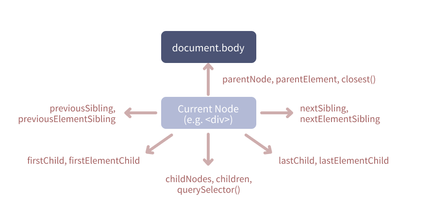

# DOM (Document Object Model)
브라우저에 의해 JavaScript에 노출되는 API의 일부이다.

### Traversing the Dom

```html
<header>hello</header>
<div>
    <p>
      A <em>test!</em>
    </p>
</div> 
<ul>
  <li>a</li>
  <li>b</li>
  <li>c</li>
</ul>
```

#### 요소 위치 정리
- Child
  - direct child node or element
  - `<p>` 태그는 `<div>`의 자식 요소이다.
  - `<em>` 태그는 `<div>`의 중첩 요소 안에 있지만 자식은 아니다.
- Descendant(후손)
  - Direct or indirect child node or element
  - `<p>, <em>` 태그 모두 후손이다.
- Parent
  - Direct parent node or element
  - `<p>` 태그의 부모는 `<div>`이다.
- Ancestors(조상)
  - Driect or indirect parent node / element
  - `<div>`는 `<p>, <em>` 태그의 조상이다.
<hr>

#### 요소 선택
1. 자식
  - childNodes를 사용할 경우 하위 텍스트 노드에 접근할 수 있다.

      ```jsx
      const ul = document.querySelector("ul");
      ul.childNodes
      //NodeList(7) [text, li, text, li, text, li, text]
      ```

  - querySelector()은 가장 가까운 자손 요소를 선택할 수 있다.
    이는 선택된 요소의 중첩 요소로 접근할 때 사용한다.
    브라우저의 모든 요소에서 찾는다.

      ```jsx
      const div = document.querySelector('div');
      div.querySelector('em');
      // <em>...</em>
      ```

  - children을 사용하면 HTMLCollection이 보인다.
    이는 유사 배열 객체로 실제 배열은 아니지만 반복문을 지원한다.

      ```jsx
      const ul = document.querySelector("ul");
      ul.children
      //HTMLCollection(3) [li, li, li]
      
      ul.children[1]
      //<li>…</li>
      ```

  - firstChild는 첫번째 자식 노드에, firstElementChild는 첫번째 자식 요소 노드에 접근한다.

      ```jsx
      const ul = document.querySelector("ul");
      ul.firstElementChild
      //<li>a</li>
      
      ul.firstChild
      //text
      ```

2. 부모
  - parentNode는 가장 가까운 부모 노드에 접근한다.
  - parentElement는 가장 가까운 부모 요소 노드에 접근한다.
  - 부모는 항상 요소 노드이기 때문에 대부분 같은 결과가 나온다.
  - parentNode과 parentElement의 차이점

      ```jsx
      document.documentElement.parentElement
      //null
      
      document.documentElement.parentNode
      //document
      ```

  - closest()은 querySelector와 같이 css 선택자를 사용한다.

    가장 가까운 조상 요소를 편리하게 선택할 수 있게 한다.

      ```jsx
      const p = document.querySelector('p');
      p.closest('body');
      // <body>...</body>
      ```

3. 형제
  - previousSibling은 가장 가까운 노드를 선택한다.

      ```jsx
      const div = document.querySelector('div');
      div.previousSibling
      //text
      ```

  - previousSibling은 가장 가까운 요소 노드를 선택한다.

      ```jsx
      const div = document.querySelector('div');
      div.previousElementSibling
      //<header>...</header>
      ```
<hr>

#### 요소 생성
1. HTML string
  - textContent

      ```jsx
      header.textContent = 'New content!'
      ```

  - innerHTML - 요소의 모든 콘텐츠를 바꿀 때 유용

      ```jsx
      header.innerHTML= '<h1>A new Title!</h1>'
      ```

    li 요소를 하나 추가할 경우 다음과 같이 입력한다.

      ```jsx
      ul.innerHTML= ul.innerHTML + '<li>new</li>'
      ```

    이런 방법을 사용하면 ul과 안에 있는 모든 요소가 새로 렌더링 되고 이는 사용자의 경험에 나쁜 영향을 끼칠 수 있다. 또한 input과 같은 요소가 있을 경우 이도 새로 렌더링 되기 때문에 사용자가 입력한 값이 사라질 수 있다.

  - insertAdjacentHTML - 기존 요소를 유지하고 추가를 할 때 유용

    기존 요소는 렌더링하지 않는다.

      ```jsx
      ul.insertAdjacentHTML('beforeend','<li>Someting</li>'); 
      ul.insertAdjacentHTML('afterend', newLi); 
      ```

2. createElement
  - createElement

      ```jsx
      const newLi = document.createElement('li');
      ul.appendChild(newLi);
      newLi.textContent = 'new item';
      ```

    이런 방법을 사용할 경우 이벤트 리스너를 추가하거나 스타일을 입히는 등 모든 것이 가능해지는 장점이 있다.

  - append vs appendChild / prepend vs prependChild

    같은 기능이지만 append가 더 짧고 append는 텍스트를 삽입할 수 있다.

      ```jsx
      ul.append('someThing');
      ```

  - before(), after()

    새로운 위치로 이동, 사파리는 지원하지 않는다.

      ```jsx
      ul.lastElementChild.before(newLi);
      ul.lastElementChild.after(newLi);
      ```

  - replaceWidth()

    요소를 교체 즉, 이전 요소는 삭제하고 새로운 요소로 교체한다.

      ```jsx
      ul.firstElementChild.replaceWidth(newLi);
      ```

  - cloneNode()

    true를 입력하면 전체 자손 요소가 모두 복제된다.

      ```jsx
      const newLi2 = newLi.cloneNode(true);
      ul.append(newLi, newLi2);
      ```
<hr>

#### 라이브 노드 리스트 / 정적 노드 리스트

   ```jsx
    const list = document.querySelector('ul');
    const listItems = list.querySelectorAll('li');
    const listItems2 = list.getElementsByTagName('li');
    const newLi = document.createElement('li');
    newLi.textContent = 'item 4';
    list.append(newLi);
   ```

위의 경우 listItems는 마지막에 추가한 li가 반영되지 않는다.

이것이 정적 노드 리스트이다.

`querySelectorAll`을 사용하면 그 안의 객체와 페이지에 표시되는 DOM 객체는 실시간으로 참조가 되지만 스냅샷으로 참조만 하기 때문에 새로운 아이템이 추가되어도 반영되지 않는다.

`getElementsByTagName`을 사용하면 유사 배열 객체가 라이브 리스트로 항시 제공되고 예전에 쿼리한 아이템이 바뀌면 같이 바뀐다.

<hr>

#### 요소 삭제
- remove()

  모두 삭제한다. 시간도 적게 걸리고 추천하는 방법이다.

    ```jsx
    list.remove();
    ```

- removeChild()

  자식 요소를 선택해 삭제한다.

    ```jsx
    list.parentElement.removeChild(list);
    ```