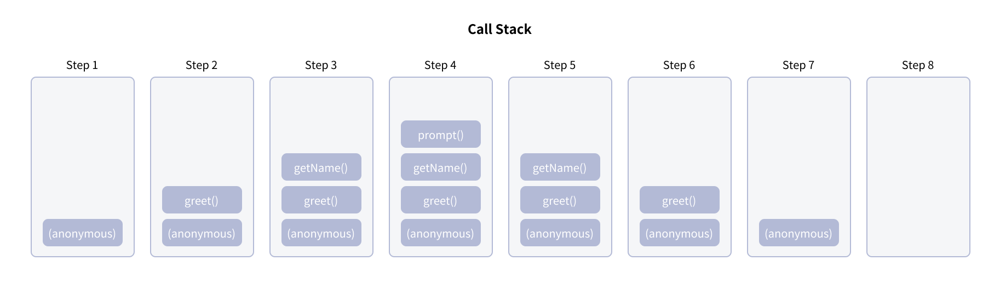

# JavaScript 엔진과 event loop

## 자바스크립트 엔진

자바스크립트 코드를 실행하는 프로그램 혹은 인터프리터

<br>

## 자바스크립트 엔진 코드 해석 순서


1. 브라우저가 HTML 파일을 읽어 스크립트를 감지하여 실행한다.
2. 인터프리터가 스크립트를 로드하고 읽어들여서 가상 머신이 이해하기 쉽게 만든 바이트 코드로 변환한다.
   인터프리터는 한줄 한줄 해석해서 바이트 코드를 만든다. 때문에 가장 빠른 방식은 아니다.
3. 인터프리터에서 전달받은 바이트 코드를 머신코드(최적화 코드)로 컴파일링 하여 컴퓨터로 전달한다.
   인터프리터에서 스크립트를 실행할 때 함께 작업이 이루어진다. 스크립트를 실행할 수 있는 가장 빠른 방법

<br>

## 자바스크립트 엔진 특징

- 브라우저별로 스크립트를 실행하는 엔진이 다르다.

  chrome의 v8 https://hackernoon.com/javascript-v8-engine-explained-3f940148d4ef

  Firefox의 Spider Monkey https://firefox-source-docs.mozilla.org/js/index.html

- 자바스크립트 엔진은 실행 및 컴파일 시간을 단축할 수 있는 최적화 기술을 적용한다.

  이전 실행과 현재 실행 시 달라진 부부닝 없는 코드의 경우 재컴파일링을 거치지 않고 컴파일 된 코드를 다시 사용한다. 이때 재컴파일될 필요가 없어서 코드를 그대로 사용하므로 빠른 방법으로 실행할 수 있다. 하지만 코드 변경으로 인터프리터를 거치게 되면 컴파일러 절차도 필요하다.

- 브라우저 API가 빌트인 되어있다.

<br>

## 자바스크립트 코드 실행 원리


### ✅ **Heap**

메모리가 할당이 되는 곳이며 선언한 변수, 함수가 담겨져 있다.

### ✅ **Call Stack**
 

코드가 실행될 때 쌓이는 곳이며 하나의 호출 스택을 사용하기 때문에 자바스크립트의 함수가 실행되는 방식을 ‘Run to Completion’이라고 부른다. 이는 하나의 함수가 실행되면 이 함수가 끝날 때까지는 다른 작업은 끼어들지 못한다.

함수의 호출들은 ‘프레임’스택을 형성한다. 함수가 실행되면 Call Stack에 새로운 프레임이 생기고 처리가 끝나면 없어지는 원리를 가지고 있다.

### ✅ Web APIs

Web APIs는 자바스크립트 엔진이 아닌 브라우저에서 제공하는 API로 비동기인 setTimeout, Promise 등이 있다.
Call Stack에서 실행된 비동기 함수들은 모두 Web API를 호출한다. 그리고 Web API는 콜백 함수를 CallBack Queue에 넣는다.

### ✅ **Callback Queue**

비동기적으로 실행된 콜백 함수가 보관되는 곳이다. 콜 스택에 가기 위한 ‘대기열’이라고 생각하면 된다. 여기에 있는 콜백 함수들은 콜스택이 비워졌을 때 먼저 대기열에 들어온 순서대로 실행된다.

<br>

### Heap, Call Stack 실행 예시

```jsx
function getName() {
    return prompt("Your name: ", "");
}

function greet() {
    const userName = getName();
    console.log("Hello" + userName);
}

greet();
```

1. 위에서 getName()과 greet()과 같이 함수를 정의하면 JavaScript가 이를 등록하고 힙에 저장된다.(힙에 저장하는 이유는 함수가 일반적으로 긴 수명을 가지며 애플리케이션에 대한 작업으로 오래도록 지속되기 때문이다.)
2. 그 다음 스크립트를 실행하면 스택이 실행된다.
3. 스택은 익명 코드(anonymous) 실행에서부터 시작된다. 이는 스크립트 파일 자체다.
4. greet(), getName(), prompt() 순서대로 스택 맨 위에 푸쉬되어 실행한다.

   (스택에서는 맨 위에 있는 항목이 항상 현재 실행 중인 항목이 된다.)

   

5. prompt()의 값을 입력하거나 취소를 누르는 등 실행이 종료되면 스택에서 방출(삭제)된다.

   *힙에서는 삭제되지 않는다

   *할당된 리소스와 함수 실행을 위해 관리되는 데이터만 제거된다.

6. getName(), gree() 또한 순서대로 값이 반환되어 스택에서 제거된다.
7. 모든 작업이 완료되면 anonymous 컨텍스트도 제거된다.

<br>

### Web API, CallBack Queue 실행 예시

```jsx
const button = document.querySelector('button');
function trackUserHandler() {
	console.log('Clicked!')
}
button.addEventListener('click', trackUserHandler);

let result = 0;
for(let i = 0; i <100000000; i++) {
	result += 1;
}
console.log(result);

// 4999999950000000
// Clicked!
```

다음과 같은 코드가 있고 실행 하자마자 버튼을 누른다고 가정했을 때 trackUserHandler 함수의 결과 값보다  result가 먼저 나오는 것을 볼 수 있다.

이는 trackUserHandler과 같이 비동기 함수가 실행되었을 때 스택이 비워져 있을 때까지 기다려서 호출하기 때문에 result의 값을 기다리고 호출한 것이다.


