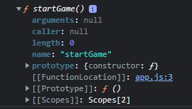

# 함수

### 함수

함수는 객체이다.

```jsx
function startGame() { 
    console.log("Game is starting...");
}

console.dir(startGame);
```

위와 같이 콘솔에 함수를 찍으면 아래처럼 키와 값이 쌍으로 되어있는 객체가 나온다. 이는 해당 함수에 포함되어있는 프로퍼티를 나타낸 것이다.

 

<hr>

### 매게변수&인수

매개변수는 함수를 정의할 때 괄호 안에 지정하는 변수입니다.

이 예시에서`name`은 매개변수입니다.

```jsx
function sayHi(name) { ... }
```

인수는 함수를 호출할 때 함수에 전달하는구체적인 값입니다.

```jsx
sayHi('Max');
```

매개변수`name`에 대해`'Max'`는 함수의 인수입니다.

인수는 복사된 값이다. 따라서 원본을 바꿔주지 않는다.
<hr>

### 나머지 매개변수 (Rest)

```jsx
const sumUp = (a, b, ...num) => {
    let sum = 0;
    for (const x of num) {
        sum += x
    }
    return sum;
}
```
<hr>

### 함수 이름짓기

| 이름     | 설명                   |
|--------|----------------------|
| get    | 값을 반환함               |
| show   | 무언가를 보여줌             |
| calc   | 무언가를 계산함             |
| create | 무언가를 생성함             |
| check  | 무언가를 확인하고 블린값을 반환함   |

<hr>

### 함수 표현식 vs 함수 선언문

```jsx
sum(1, 2) //3

// 함수 선언문
function sum(a, b) {
  return a + b;
}
```

자바스크립트는 함수를 모두 문서의 위쪽에 초기화 한다.

때문에 함수 선언문은 함수가 어디에 있던지 사용이 가능하다.

```jsx
sum(1, 2) //Cannot access 'sum' before initialization

// 함수 표현식
let sum = function(a, b) {
  return a + b;
};
```

함수 표현식에서 정의 이전에 sum()을 호출하면 초기화 전에는 접근할 수 없다고 에러가 나온다.
<hr>

### 익명함수에 이름을 적어주는 이유

이름이 없으면 함수의 오류를 찾기 어렵기 때문이다.

```jsx
startGameBtn.addEventListener('click', function() {
    conosle.log(age);
});

//age is not defined
//at HTMLButtonElement.<anonymous>

startGameBtn.addEventListener('click',  function start() {
    conosle.log(age);
});

//age is not defined
//at HTMLButtonElement.start
```
<hr>

### 콜백함수

```jsx
function introduce (lastName, firstName, callback) {
    var fullName = lastName + firstName;
    
    callback(fullName);
}

introduce("홍", "길동", function(name) {
    console.log(name);
});
//홍길동
```
<hr>

### 메서드

- 객체에 함수가 저장된 것을 메서드라고 한다.

    ```jsx
    const person = {
        name: "Max",
        greet: function greet() {
            console.log("Hello there!");
        },
    };
    
    person.greet();
    ```

  person객체 안에 `greet`라는 메서드가 있다.

    ```jsx
    startGameBtn.addEventListener("click", startGame);
    ```

  startGameBtn 객체 안에 `addEventListener`라는 메서드가 있다.

- bind()

    ```jsx
    function sum(num) {
        return num + this.num1 + this.num2; // 5 + 20 + 3
    }
    var myObj = {num1:20, num2: 3};
    var customSum = sum.bind(myObj);
    console.log(customSum(5)); //28
    ```

  함수의 인자를  ‘사전 구성’하려는 상황에서 함수를 직접 호출하지 않을 때 유용하다.

  bind함수를 사용하면 this는 내가 정한 object로 고정된다.

- call
- apply