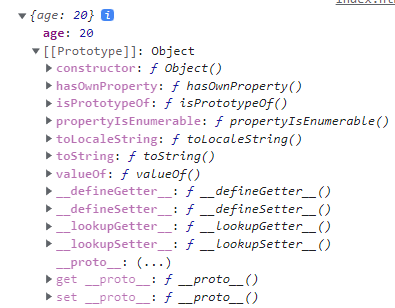

# [표현식] new

## new 연산자와 생성자 함수

### ✅ 생성자 함수

생성자 함수를 만들기 위해 두 관례를 따른다.

1. 보통 함수 이름의 첫 글자는 대문자로 시작한다.
2. 반드시 `'new'` 연산자를 붙여 실행한다.

```jsx
function Animal(type,name,sound) {
	this.type = type;
  this.name = name;
  this.sound = sound;
}

const dog = new Animal("강아지", "쿠키", "멍멍");

alert(dog.name); // 쿠키
alert(dog.sound); // 멍멍
```

new 키워드 없이 Amimal를 호출하면 오류가 생긴다.

이유는 new가 있기 때문에 객체가 반환되기 때문인데 new가 없으면 함수는 아무것도 반환하지 않기 때문이다.

```jsx
function Animal(type,name,sound) {
  this = {};
	//...
	return this;
}
```

new 키워드는 함수 내에서 위와 같은 작업을 한다.

함수를 new 키워드로 호출할 때 new 키워드는 this라는 객체를 만든 후 this를 리턴한다.

<br>

### ✅ 생성자 함수 프로토타입

프로토타입은 객체 생성자 함수 아래에 .prototype.[원하는키] = 코드 를 입력하여 설정할 수 있다.

```jsx
...
Amimal.prototype.say = function() = {
	console.log(this.sound);
};

const dog = new Animal("강아지", "쿠키", "멍멍");
dog.say(); //멍멍
```

<br>

### ✅ 객체 생성자 상속받기

생성자 함수도 상속을 받을 수 있다.

```jsx
...
Animal.prototype.say = function() {
  console.log(this.sound);
};

function Dog(name, sound) {
  Animal.call(this, '개', name, sound);
}
Dog.prototype = Animal.prototype;

function Cat(name, sound) {
  Animal.call(this, '고양이', name, sound);
}
Cat.prototype = Animal.prototype;

const dog = new Dog('멍멍이', '멍멍');
const cat = new Cat('야옹이', '야옹');

dog.say();
cat.say();
```

위 코드를 보면 Dog와 Cat 함수에서 Animal.call을 호출하여 첫번째 인자는 this를, 나머지 인자에는 필요로하는 파라미터를 넣어줬다.

프로토타입을 공유해야 하기 때문에 상속받은 객체 생성자 함수를 만들고 나서 prototype 값을 Animal.prototype으로 설정해준다.

<br>

## Prototypes

자바스크립트의 모든 객체는 [[prototype]]이라는 인터널 슬롯을 가진다. [[prototype]] 의 값은 null 또는 객체이며 상속을 구현하는데 사용한다.

[[prototype]] 의 값은 prototype(프로토타입) 객체이며 __proto__ accessor property로 접근할 수 있다. (__proto__ 프로퍼티에 접근하면 내부적으로 Object.getPrototypeOf가 호출되어 프로토타입 객체를 반환한다.

```jsx
let student = {
  name: 'Lee',
  score: 90
}

console.log(student.__proto__ === Object.prototype); // true
```

모든 객체는 자신의 프로토타입 객체를 가리키는 [[prototype]] 인터널 슬롯을 가지며 상속을 위해 사용된다.

함수도 객체이므로 [[prototype]] 인터널 슬롯을 갖는다. 또한 함수 객체는 일반 객체와는 달리 prototype 프로퍼티도 소유한다.

### ✅ [[prototype]]

함수를 포함한 모든 객체가 가지고 있는 인터널 슬롯이다.

객체의 입장에서 자신의 부모 역할을 하는 프로토타입 객체를 가리키며 함수 객체의 경우 Function.prototype을 가리킨다.

```jsx
function Person(name) {
  this.name = name;
}

console.log(Person.__proto__ === Function.prototype);
```

<br>

### ✅ prototype 프로퍼티

함수 객체만 가지고 있는 프로퍼티이다.

함수 객체가 생성자로 사용될 때 이 함수를 통해 생성될 객체의 부모 역할을 하는 객체(프로토타입 객체)를 가리킨다.

```jsx
var foo = new Person('Max');

console.log(Person.prototype === foo.__proto__);
```

<br>

### ✅ Prototype Chain

자바스크립트는 특정 객체의 프로퍼티나 메소드에 접근하려고 할 때 해당 객체에 기능이 없다면 [[prototype]]이 가리키는 링크를 따라 자신의 부모 역할을 하는 프로토타입 객체의 프로퍼티나 메소드를 차례대로 검색한다.

위의 예시에서 toString()을 사용하면 결과가 나오는 것을 볼 수 있다.

```jsx
let student = {
  age: 20,
}

console.log(student.toString()) //[object Object]
```

실행 순서는 다음과 같다.

1. student라는 객체에서 toString() 메서드를 찾는다. 이때 찾으면 메소드를 호출한다.
2. student에서 메서드를 찾지 못하므로 student 객체의 prototype이 가리키는 링크를 따라가 Object.prototype에서 찾는다.



<br>

### ✅ Method Types

클래스 안에 함수를 생성할 때 3가지 방법을 사용할 수 있다.

1. Method Shorthand

    ```jsx
    class Person {
    	greet() {
    		console.log('hello')
    	}
    }
    
    const a = new Person();
    const b = new Person();
    
    console.log(a); //Person {}
    console.log(a.__proto__); //{constructor: ƒ, greet: ƒ}
    ```

   위와 같이 클래스 내에서 메서드를 생성할 때 자동으로 prototype으로 등록된다.

   (프로토타입 주소만 공유하므로 추가 생성 시 별도의 리소스가 들지 않음)

2. Property Function

    ```jsx
    class Person {
    	greet = function() { … }
    	constructor() {
    		this.greet2 = function() { … }
    	}
    }
    
    const a = new Person();
    const b = new Person();
    
    console.log(a); // Person {greet: ƒ}
    console.log(a.__proto__); //{constructor: ƒ}
    ```

   인스턴스가 생성될 때마다 함수가 객체별로 다시 생성된다. (즉, 리소스 비용이 든다)

3. Property Arrow Function

    ```jsx
    class Person {
    	greet = () => { … }
    	constructor() {
    		this.greet2 = () => { … }
    	}
    }
    ```

   화살표 함수로도 사용이 가능하다.

   보통은 객체를 10000개 이상 생성하는 이유가 아니면 이러한 방법을 많이 쓰는데 이유는 this 때문이다.

    ```jsx
    class Person {
      name = 'Max'
    	greet = () => {
    		console.log(this.name)
    	}
    }
    
    const a = new Person();
    const btn = document.createElement('button');
    btn.addEventListener('click',a.greet);
    btn.click() //Max
    ```

<br>

### ✅ Setting & Gatting

해당 객체의 프로토타입을 가져올 때 __proto__는 비공식 기능이며 이를 코드에 심고자 할 경우에는 getPrototypeOf를 사용하는게 좋다.

```jsx
const course = {
    title: 'JavaScript - Guide',
    rating: 4,
}

Object.setPrototypeOf(course, {
    ...Object.getPrototypeOf(course),
    printRating: function() {
        console.log(`${this.rating}/5`);
    }
});

course.printRating(); //4/5
```

setPrototypeOf는 프로토타입을 추가하거나 새롭게 설정하고 싶을 때 사용한다.

create 기능을 사용하여 프로토타입이 course인 새로운 객체를 생성할 수 있다.

```jsx
let math = Object.create(course);
console.log(math.__proto__); //{title: 'JavaScript - Guide', rating: 4}
console.log(math.__proto__.__proto__); //{printRating: ƒ}
math.printRating(); //4/5
```