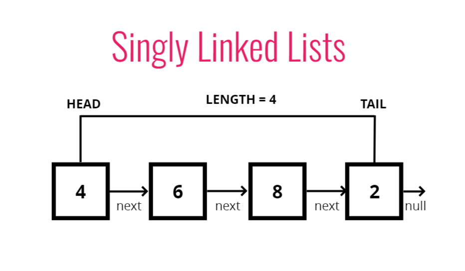

# 자료구조

## 단방향 연결 리스트



단방향 연결 리스트는 다음과 같은 특징을 가지고 있다

1. 인덱스가 없음
2. next 포인터가 있는 노드를 통해 연결됨
3. 임의 인덱스 접근이 허용되지 않음 (순서대로 따라가야 함)

이는 배열과 다른 특징을 가지고 있는데 배열은

1. 인덱스가 있음
2. 삽입 및 삭제 비용이 많이 들 수 있음
3. 특정 인덱스에서 빠르게 접근 가능

<br>

### ✅ push 메소드 구현

```jsx
class Node {
    constructor(val) {
        this.val = val;
        this.next = null;
    }
}

class SinglyLinkedList {
    constructor() {
        this.head = null;
        this.tail = null;
        this.length = 0;
    }
    push(val) {
        let newNode = new Node(val);
        if (!this.head) {
            this.head = newNode;
            this.tail = this.head;
        } else {
            this.tail.next = newNode;
            this.tail = newNode;
        }
        this.length++;
        return this;
    }
}

let list = new SinglyLinkedList();
list.push("HELLO");
list.push("GOODBYE");
list.push("END"); //SinglyLinkedList {head: Node, tail: Node, length: 3}
```

<br>

### ✅ pop 메소드 구현

```jsx
class SinglyLinkedList {
    ...
    pop() {
        if (!this.head) return undefined;
        let current = this.head;
        let newTail = current;
        while (current.next) {
            newTail = current;
            current = current.next;
        }
        this.tail = newTail;
        this.tail.next = null;
        this.length--;
        if (this.length === 0) {
            this.head = null;
            this.tail = null;
        }
        return current;
    }
    ...
}

list.pop(); //Node {val: 'END', next: null}
```

<br>

### ✅ pop 메소드 구현

```jsx
class SinglyLinkedList {
    ...
    pop() {
        if (!this.head) return undefined;
        let current = this.head;
        let newTail = current;
        while (current.next) {
            newTail = current;
            current = current.next;
        }
        this.tail = newTail;
        this.tail.next = null;
        this.length--;
        if (this.length === 0) {
            this.head = null;
            this.tail = null;
        }
        return current;
    }
    ...
}

list.pop(); //Node {val: 'END', next: null}
```

<br>

### ✅ shift 메소드 구현

```jsx
class SinglyLinkedList {
    ...
    shift() {
        if (!this.head) return undefined;
        let currentHead = this.head;
        this.head = currentHead.next;
        this.length--;
        if (this.length === 0) {
            this.tail = null;
        }
        return currentHead;
    }
    ...
}

list.shift(); //Node {val: 'HELLO', next: Node}
```

<br>

### ✅ unshift 메소드 구현

```jsx
class SinglyLinkedList {
    ...
    unshift(val) {
        let newNode = new Node(val);
        if (!this.head) {
            this.head = newNode;
            this.tail = newNode;
        } else {
            newNode.next = this.head;
            this.head = newNode;
        }
        this.length++;
        return this;
    }
    ...
}

list.unshift('wow'); //SinglyLinkedList {head: Node, tail: Node, length: 4}
```

<br>

### ✅ get 메소드 구현

```jsx
class SinglyLinkedList {
    ...
    get(index) {
        if (index < 0 || index >= this.length) return null;
        let counter = 0;
        let current = this.head;
        while (counter !== index) {
            current = current.next;
            counter++;
        }
        return current;
    }
    ...
}

list.get(1); //Node {val: 'GOODBYE', next: Node}
```

<br>

### ✅ set 메소드 구현

```jsx
class SinglyLinkedList {
    ...
    set(index, val) {
        let foundNode = this.get(index);
        if (foundNode) {
            foundNode.val = val;
            return true;
        }
        return false;
    }
    ...
}

list.set(1, 'change'); //true
```

<br>

### ✅ insert 메소드 구현

```jsx
class SinglyLinkedList {
    ...
    insert(index, val) {
        if (index < 0 || index > this.length) return false;
        if (index === this.length) return !!this.push(val);
        if (index === 0) return !!this.unshift(val);

        let newNode = new Node(val);
        let prev = this.get(index - 1);
        let temp = prev.next;
        prev.next = newNode;
        newNode.next = temp;
        this.length++;
        return true;
    }
    ...
}

list.insert(1, 'wow'); //true
```

<br>

### ✅ remove 메소드 구현

```jsx
class SinglyLinkedList {
    ...
    remove(index) {
        if (index < 0 || index >= this.length) return undefined;
        if (index === this.length - 1) return this.pop();
        if (index === 0) return this.shift();

        let prev = this.get(index - 1);
        let removed = prev.next;
        prev.next = removed.next;
        this.length--;
        return removed;
    }
    ...
}

list.remove(1); //Node {val: 'GOODBYE', next: Node}
```

<br>

### ✅ reserve 메소드 구현

```jsx
class SinglyLinkedList {
    ...
    reverse() {
        let node = this.head;
        this.head = this.tail;
        this.tail = node;
        let prev = null;
        let next;
        for (let i = 0; i < this.length; i++) {
            next = node.next;
            node.next = prev;
            prev = node;
            node = next;
        }
        return this;
    }
    ...
}

list.remove(1); //SinglyLinkedList {head: Node, tail: Node, length: 3}
```

<br>

## 빅오 복잡도

단방향 연결 리스트는 삽입과 삭제의 경우 Array에 비해 우수하다.

| 알고리즘 | 복잡도 |
| --- | --- |
| Insertion | O(1) |
| Removal | O(1) or O(N) |
| Searching | O(N) |
| Access | O(N) |