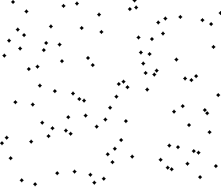

# 정렬 알고리즘

## 정렬 종류

### 버블 정렬

<div style="display: flex; gap: 10px;">
    
    
</div>

이름의 유래는 정렬 과정에서 원소의 이동이 거품이 수면으로 올라오는 듯한 모습을 보이기 때문에 지어졌다.

시간 복잡도는 짧은 배열인 경우 O(n), 긴 배열의 경우 O(n2)이다.

선택 정렬과 개념이 유사하다

인접한 두 원소를 검사하여 정렬하는 알고리즘이다.

오름차순으로 정렬할 때 첫번째 반복에 배열의 최대값이 맨 뒤로 이동한다.

반복을 거듭함에 따라 정렬해야 하는 항목 수가 감소한다.

```jsx
function bubbleSort(arr) {
    let noSwaps = true;
    for (let i = arr.length; i > 0; i--) {
        noSwaps = true;
        for (let j = 0; j < i - 1; j++) {
            if (arr[j] > arr[j + 1]) {
                [arr[j], arr[j + 1]] = [arr[j + 1], arr[j]];
                noSwaps = false;
            }
        }
        if (noSwaps) break;
    }
    return arr;
}

bubbleSort([85, 1, -3, 8, 45, 10]) //[-3, 1, 8, 10, 45, 85]
```
<br>

### 선택 정렬

시간복잡도는 항상 O(n²)이다

버블 정렬과 비슷하지만 배열의 최소값이나 최대값을 **선택**해 데이터의 위치를 교환하는 차이점이 있다.

```jsx
function selectionSort(arr) {
    for (let i = 0; i < arr.length; i++) {
        let min = i;
        for (let j = i + 1; j < arr.length; j++) {
            if (arr[min] > arr[j]) min = j;
        }
        if (i !== min) {
            [arr[i], arr[min]] = [arr[min], arr[i]];
        }
    }
    return arr;
}

selectionSort([85, 1, -3, 8, 45, 10]);//[-3, 1, 8, 10, 45, 85]
```
<br>

### 삽입 정렬

시간복잡는 거의 정렬된 경우 O(n), 정렬되지 않은 배열은 O(n2)이다.

거의 정렬되어 있는 배열에 사용할 수록 빠르며 실시간으로 데이터가 계속 들어오는 경우 유리하다.

손안의 카드를 정렬하는 방법과 유사하다 (새로운 카드를 기존의 정렬된 카드 사이 올바른 위치에 삽입하는 것)

매 순서마다 해당 원소를 삽입할 수 있는 위치를 찾아 해당 위치에 삽입한다.

```jsx
function insertionSort(arr) {
    for (let i = 1; i < arr.length; i++) {
        let currentVal = arr[i];
        for (var j = i - 1; j >= 0 && arr[j] > currentVal; j--) {
            arr[j + 1] = arr[j];
        }
        arr[j + 1] = currentVal;
    }
    return arr;
}
    
insertionSort([5, 6, 2]); //[2, 5, 6]
```

위 코드를 해석해보면 다음과 같다

1. 배열 맨 끝 숫자 2(currentVal) 기준 6과 비교하여 6이 크므로 배열을 수정한다 `[5, 6, 6]`
2. 5와 2를 비교하여 5가 크므로 배열을 수정한다 `[5, 5, 6]`
3. j의 인덱스에 currentVal을 넣어준다 `[2, 5, 6]`

<br>

### 합병 정렬

시간복잡도는 항상 O(n log n)이다.

공간복잡도는 O(n)이다.

배열을 더 작은 방식으로 나누는 방식을 사용한다.

```jsx
function merge(arr1, arr2) {
    let result = [];
    let i = 0;
    let j = 0;
    while (i < arr1.length && j < arr2.length) {
        if (arr1[i] > arr2[j]) {
            result.push(arr2[j]);
            j++;
        } else {
            result.push(arr1[i]);
            i++;
        }
    }

    while (i < arr1.length) {
        result.push(arr1[i]);
        i++;
    }

    while (j < arr2.length) {
        result.push(arr2[j]);
        j++;
    }

    return result;
}

function mergeSort(arr) {
    if (arr.length <= 1) return arr;
    let mid = Math.floor(arr.length / 2);
    let left = mergeSort(arr.slice(0, mid));
    let right = mergeSort(arr.slice(mid));

    return merge(left, right);
}

mergeSort([10, 24, 76, 73]); //[10, 24, 73, 76]
```

<br>

### 퀵 정렬

시간 복잡도는 평균 O(n log n), 최하일 경우 O(n**²**)이다.

데이터를 분할하여 배열에 0개 또는 1개의 항목이 남을 때까지 분할하여 개별적으로 정렬되는 방식이다.

피벗 포인트라 부르는 단일 요소를 선택하여 수행한다.

이 과정을 왼쪽과 오른쪽에 계속 반복한다.

```jsx
function pivot(arr, start = 0, end = arr.length - 1) {
    const swap = (array, i, j) => {
        [array[i], array[j]] = [array[j], array[i]];
    };
    let pivot = arr[start];
    let swapIdx = start;

    for (let i = start + 1; i <= end; i++) {
        if (pivot > arr[i]) {
            swapIdx++;
            swap(arr, swapIdx, i);
        }
    }

    swap(arr, start, swapIdx);
    return swapIdx;
}

function quickSort(arr, left = 0, right = arr.length - 1) {
    if (left < right) {
        let pivotIndex = pivot(arr, left, right);
        //left
        quickSort(arr, left, pivotIndex - 1);
        //right
        quickSort(arr, pivotIndex + 1, right);
    }
    return arr;
}

quickSort([4, 6, 9, 1, 2, 5, 3]); //[1, 2, 3, 4, 5, 6, 9]
```

<br>

### 기수 정렬

시간 복잡도는 항상 O(nk)이다. 여기서 k는 수의 길이로, 워드 사이즈라 불리는데 자릿수를 뜻한다.

n은 배열의 길이를 뜻한다.

비교를 수행하지 않는 특별한 정렬 알고리즘이고, 숫자로 작동한다.

비교 대신, 숫자 크기에 대한 정보를 자릿수로 인코딩한다.

```jsx
function getDigit(num, i) {
    return Math.floor(Math.abs(num) / Math.pow(10, i)) % 10;
}

function digitCount(num) {
    if (num === 0) return 1;
    return Math.floor(Math.log10(Math.abs(num))) + 1;
}

function mostDigits(nums) {
    let maxDigits = 0;
    for (let i = 0; i < nums.length; i++) {
        maxDigits = Math.max(maxDigits, digitCount(nums[i]));
    }

    return maxDigits;
}

function radixSort(nums) {
    let maxDigitCount = mostDigits(nums);
    for (let k = 0; k < maxDigitCount; k++) {
        let digitBuckets = Array.from({ length: 10 }, () => []);
        for (let i = 0; i < nums.length; i++) {
            let digit = getDigit(nums[i], k);
            digitBuckets[digit].push(nums[i]);
        }
        nums = [].concat(...digitBuckets);
    }

    return nums;
}

radixSort([10, 55550, 846, 15, 66]);
```

<br>

## 정렬 비교


| 알고리즘 | 시간 복잡도<br>(최상) | 시간 복잡도<br>(평균) | 시간 복잡도<br>(최하) | 공간 복잡도 |
| --- | --- | --- | --- | --- |
| 버블 정렬 | O(n) | O(n²) | O(n²) | O(1) |
| 선택 정렬 | O(n²) | O(n²) | O(n²) | O(1) |
| 삽입 정렬 | O(n) | O(n²) | O(n²) | O(1) |
| 합병 정렬 | O(n log n) | O(n log n) | O(n log n) | O(n) |
| 퀵 정렬 | O(n log n) | O(n log n) | O(n²) | O(log n) |
| 기수 정렬 | O(nk) | O(nk) | O(nk) | O(n+k) |

<br>

## 정렬 알고리즘 시각화 사이트

[Sorting Algorithms Animations](https://www.toptal.com/developers/sorting-algorithms)