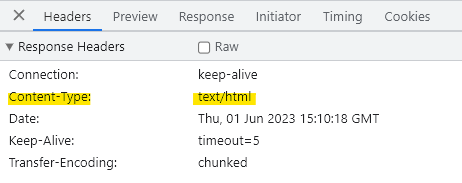

# Node.js

Chrome V8 JavaScript 엔진으로 빌드 된 JavaScript 런타임이다.

즉, 노드를 통해 다양한 자바스크립트 애플리케이션을 실행할 수 있으며, 서버를 실행하는 데 제일 많이 사용된다.

- Node.js는 서버사이트 스크립트 언어가 이닌 프로그램(환경)이다.
- 자바스크립트를 브라우저 말고도 로컬 PC에서도 실행시켜줄 수 있는 실행창(런타임)이다.
- Node.js는 JavaScript를 서버에서도 사용할 수 있도록 만든 프로그램이다.

```jsx
//app.js
console.log("Hello world!"); //console.log는 브라우저, node.js 모두 지원하는 API이다.
```

위와 같이 입력하고 터미널을 열어 node app.js를 입력하면 Hello World!가 출력되는 것을 볼 수 있다.

이는 Node.js가 파일을 실행했기 때문에 얻을 수 있는 출력값이다.

<br>

### ✅ 파일 생성 / 읽기

node.js로 다른 파일을 생성할 수 있다.

```jsx
const fs = require("fs");

fs.writeFile("user-data.txt", "username=Max", (err) => {
  if (err) console.log(err);
  else console.log("Wrote to file!");
});
```

다른 파일을 읽을 수도 있다.

```jsx
fs.readFile("user-data.txt", (err, data) => {
  if (err) console.log(err);
  else console.log(data.toString()); //username=Max
});
```

<br>

### ✅ HTTP 요청

우리가 www.naver.com을 실행하면 서버에서 페이지를 전달받는 것처럼 node.js로 서버를 만들어 전달할 수 있다.

```jsx
//app.js
const http = require("http");

/**서버 설계
 * request : 들어오는 요청을 반영하며 요청의 일부인 헤더와 데이터 등이 있다
 * response : 응답을 구상할 수 있으며 보낸다.
 */
function handleRequest(request, response) {
  //브라우저에 요청이 성공했는지 여부 알림
  response.statusCOde = 200;
  response.write("<h1>Hello World</h1>");
  //응답 보내기
  response.end();
}

const server = http.createServer(handleRequest);

//서버 실행 및 포트번호 전달
//개발 중에는 3000을 사용, 실제로는 80이나 443 사용
server.listen(3000);
```

모두 작성한 다음 터미널에서 node app.js를 입력하고 브라우저 창을 열어 [localhost:3000](http://localhost:3000) 을 입력한다.

다른 경로에서의 응답은 다음과 같이 처리한다.

```jsx
function handleRequest(request, response) {
  if (request.url === "/currenttime") {
    response.statusCOde = 200;
    response.end(`<h1>${new Date().toISOString()}</h1>`);
    return;
  }

  response.statusCOde = 200;
  response.end("<h1>Hello World</h1>");
}
```

위와 같이 작성 후 브라우저 창에 [localhost:3000/currenttime](http://localhost:3000/currenttime) 을 입력하면 현재 시간이 나온다.

내용을 수정할 경우 진행중인 프로세스는 이전 파일에 기반하여 보여지기 때문에 서버를 종료하고 재시작해야 한다.

 <br>

헤더를 구성할 수도 있다.

```jsx
function handleRequest(request, response) {
  /**헤더
   * 첫번째 인자 : 헤더 식별자
   * 두번째 인자 : 헤더에 대한 값
   */
  response.setHeader("Content-Type", "text/html");
}
```



두 번째 인자로 text/html 대신 text/plain을 적으면 HTML로 렌더링 되지 않는다.

<br>

### ✅ 데이터 파싱&응답 - 연습

폼 데이터를 주고 받기 위해서 response.write를 다음과 같이 수정해준다.

```jsx
...
response.write(
  `<form method='POST' action='/'>
      <input name='username' type='text'>
      <button type='submit'>Send</button>
  </form>`
);
...
```

그런 다음 request를 추가해준다.

```jsx
const server = http.createServer((request, response) => {
  let body = [];
  //데이터가 추가될 때마다 실행
  request.on("data", (chunk) => {
    body.push(chunk);
  });
  //request에서 읽기가 끝날 때 실행
  request.on("end", () => {
    //Buffer은 node.js에서 사용할 수 있는 전역 객체이다.
    //청크로 인코딩 된 배열을 일반 문자열로 변환하는 방식이다.
    body = Buffer.concat(body).toString();
    console.log(body);
  });
	...
});
```

이렇게 코드 입력 후 페이지를 열어 bell이라는 이름을 입력 후 전송하면 서버에 다음과 같이 표기된다.

`username=bell`

**전체 코드**

```jsx
const http = require("http");

const server = http.createServer((request, response) => {
  let body = [];
  request.on("data", (chunk) => {
    body.push(chunk);
  });
  request.on("end", () => {
    body = Buffer.concat(body).toString();
    let userName = "Unknown User";
    if (body) userName = body.split("=")[1];
    response.setHeader("Content-Type", "text/html");
    response.write(
      `<h1>Hi ${userName}</h1>
       <form method='POST' action='/'>
           <input name='username' type='text'>
           <button type='submit'>Send</button>
       </form>`
    );
    response.end();
  });
});

server.listen(3000);
```
