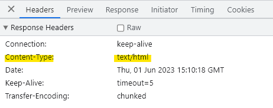

# NodeJs 기초

## Node.js

Chrome V8 JavaScript 엔진으로 빌드 된 JavaScript 런타임이다.

즉, 노드를 통해 다양한 자바스크립트 애플리케이션을 실행할 수 있으며, 서버를 실행하는 데 제일 많이 사용된다.

- Node.js는 서버사이트 스크립트 언어가 이닌 프로그램(환경)이다.
- 자바스크립트를 브라우저 말고도 로컬 PC에서도 실행시켜줄 수 있는 실행창(런타임)이다.
- Node.js는 JavaScript를 서버에서도 사용할 수 있도록 만든 프로그램이다.

```jsx
//app.js
console.log("Hello world!"); //console.log는 브라우저, node.js 모두 지원하는 API이다.
```

위와 같이 입력하고 터미널을 열어 node app.js를 입력하면 Hello World!가 출력되는 것을 볼 수 있다.

이는 Node.js가 파일을 실행했기 때문에 얻을 수 있는 출력값이다.

### ✅ 파일 생성 / 읽기

node.js로 다른 파일을 생성할 수 있다.

```jsx
const fs = require("fs");

fs.writeFile("user-data.txt", "username=Max", (err) => {
  if (err) console.log(err);
  else console.log("Wrote to file!");
});
```

다른 파일을 읽을 수도 있다.

```jsx
fs.readFile("user-data.txt", (err, data) => {
  if (err) console.log(err);
  else console.log(data.toString()); //username=Max
});
```

### ✅ HTTP 요청

아래와 같이 입력하면 [localhost:3000](http://localhost:3000) 포트에 hello there!이 입력되어 나온다.

```jsx
const http = require("http");

/**서버 설계
 * request : 들어오는 요청을 반영하며 요청의 일부인 헤더와 데이터 등이 있다
 * response : 응답을 구상할 수 있으며 보낸다.
 */
const server = http.createServer((request, response) => {
  response.write("hello there!");
  response.end(); //응답 보내기
});

/**서버 실행
 * 3000 : 포트 설정
 */
server.listen(3000);
```

html 태그를 입력하여 출력할 수도 있다.

```jsx
...
response.write("<h1>hello there!</h1>");
...
```

이렇게 내용을 수정할 경우 진행중인 프로세스는 이전 파일에 기반하여 보여지기 때문에 서버를 종료하고 재시작해야 한다.


헤더를 구성할 수도 있다.

```jsx
const server = http.createServer((request, response) => {
  /**헤더
   * 첫번째 인자 : 헤더 식별자
   * 두번째 인자 : 헤더에 대한 값
   */
  response.setHeader("Content-Type", "text/html");
	...
});
```



두 번째 인자로 text/html 대신 text/plain을 적으면 HTML로 렌더링 되지 않는다.

### ✅ 데이터 파싱&응답 - 연습

폼 데이터를 주고 받기 위해서 response.write를 다음과 같이 수정해준다.

```jsx
...
response.write(
  `<form method='POST' action='/'>
      <input name='username' type='text'>
      <button type='submit'>Send</button>
  </form>`
);
...
```

그런 다음 request를 추가해준다.

```jsx
const server = http.createServer((request, response) => {
	let body = [];
  //데이터가 추가될 때마다 실행
  request.on("data", (chunk) => {
    body.push(chunk);
  });
  //request에서 읽기가 끝날 때 실행
  request.on("end", () => {
    //Buffer은 node.js에서 사용할 수 있는 전역 객체이다.
    //청크로 인코딩 된 배열을 일반 문자열로 변환하는 방식이다.
    body = Buffer.concat(body).toString();
    console.log(body);
  });
	...
});
```

이렇게 코드 입력 후 페이지를 열어 bell이라는 이름을 입력 후 전송하면 서버에 다음과 같이 표기된다.

`username=bell`

**전체 코드**

```jsx
const http = require("http");

const server = http.createServer((request, response) => {
  let body = [];
  request.on("data", (chunk) => {
    body.push(chunk);
  });
  request.on("end", () => {
    body = Buffer.concat(body).toString();
    let userName = "Unknown User";
    if (body) userName = body.split("=")[1];
    response.setHeader("Content-Type", "text/html");
    response.write(
      `<h1>Hi ${userName}</h1>
       <form method='POST' action='/'>
           <input name='username' type='text'>
           <button type='submit'>Send</button>
       </form>`
    );
    response.end();
  });
});

server.listen(3000);
```

<br>

## Express.js

Express는 미들웨어 기반 프레임워크로  여러 다른 함수들을 통해 들어오는 요청을 전달하는 역할을 한다. 쉽게 말해서 node.js를 더 쉽게 사용하기 위한 프레임워크이다.

Express.js를 사용하기 위해 npm 프로젝트로 바꾼 후 설치해준다.

```
$ npm init
$ npm install express --save
```

그런 다음 아래와 같이 입력해준다.

```jsx
const express = require("express");

const app = express();

//미들웨어 등록
app.use((req, res, next) => {
  res.setHeader("Content-Type", "text/html");
  //모든 next는 express.js에 아직 작업이 완료되지 않았다고 알림
  next();
});

app.use((req, res, next) => {
  res.send("<h1>Hello World!</h1>");
});

app.listen(3000);
```

### ✅ body-parser

이 패키지는 req 본문을 분석하고 req객체에 추가해준다.

```
$ npm install body-parser --save
```

body-parser과 Express.js를 이용한 데이터 파싱&응답 연습

```jsx
const express = require("express");
const bodyParser = require("body-parser");

const app = express();

//들어오는 요청 본문을 분석하고 추출함
//extended로 본문이 분석되는 방식을 제어 (기본 값)
app.use(bodyParser.urlencoded({ extended: false }));

//body-parser가 분석된 본문을 req 객체의 본문 필드에 내보냄
app.use((req, res, next) => {
  res.setHeader("Content-Type", "text/html");
  //모든 next는 express.js에 아직 작업이 완료되지 않았다고 알림
  next();
});

//app.use 안의 req는 모두 동기화 되어 같은 값을 지님
app.use((req, res, next) => {
  const userName = req.body.username || "Unknown User";
  res.send(
    `<h1>Hi ${userName}</h1>
     <form method='POST' action='/'>
         <input name='username' type='text'>
         <button type='submit'>Send</button>
     </form>`
  );
});

app.listen(3000);
```

### ✅ EJS & 템플릿

ejs를 사용해 html구문을 쉽게 렌더링 할 수 있다.

```html
<!-- view/index.ejs -->
<!DOCTYPE html>
<html lang="en">
  <head>
    <meta charset="UTF-8" />
    <meta http-equiv="X-UA-Compatible" content="IE=edge" />
    <meta name="viewport" content="width=device-width, initial-scale=1.0" />
    <title>NodeJs Demo</title>
  </head>
  <body>
    <h1>Hello <%= user %></h1>
    <form method="POST" action="/">
      <input name="username" type="text" />
      <button type="submit">Send</button>
    </form>
  </body>
</html>
```

<%=와  %>사이에는 뷰에 제공할 변수의 이름을 참조할 수 있다.

이는 ejs 패키지가 이해하는 구문이다.

```jsx
...
app.set("view engine", "ejs"); //확장자 설정
app.set("views", "views"); //폴더명과 같아야 함

...

app.use((req, res, next) => {
  const userName = req.body.username || "Unknown User";
  /**render
   * 첫번째 인자 : 렌더링하고자 하는 view의 이름
   * 두번째 인자 : 템플릿에 전달하고자 하는 전체 프로퍼티 객체
   */
  res.render("index", {
    user: userName,
  });
});

app.listen(3000);
```