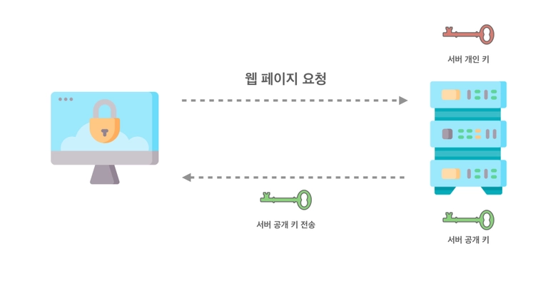

# HTTP / HTTPS

## HTTP

**Hyper Text Transfer Protocol**의 약자로 텍스트 기반의 통신 규약을 뜻한다.

인터넷에서 데이터를 주고받을 수 있는 **통신 프로토콜**이다.


<br> 

## HTTPS

**Hyper Text Transfer Protocol Secure** 의 약자

이때 Secure은 안전하다는 뜻으로 기존의 HTTP보다 안전한 것이 `HTTPS`이다.

### HTTPS 특징

1. 내가 사이트에 보내는 정보를 제 3자가 못 보게 한다.<br><br>

   **대칭키 방식**

    

   메시지 해독 방법을 같이 공유하는 방식이다.

   처음에 서버에서 키를 받아와야 하기 때문에 탈취 위험성이 있다.<br><br>

   **비대칭키 / 공개키 방식**

   

   A키로 암호화를 하면 B키로 풀 수 있는 방식이다.

   
 
   같은 공개키로는 암호화된 내용을 해독할 수 없다

   오직 개인키를 가진 곳에서만 풀 수 있다.


2. 접속한 사이트가 믿을 만한 곳인지를 알려준다.

   개인키로 암호화된 정보는 오직 공개키로 풀 수 있다.
   다른 피싱 사이트에서 보낸 정보는 공개키로 풀 수 없기 때문에 안전한 사이트/불안전한 사이트를 구분할 수 있다.

<br>

## HTTP 요청 보내기

https://jsonplaceholder.typicode.com/ 사이트 이용

### XMLHttpRequest()

```jsx
const xhr = new XMLHttpRequest();

/**요청을 구성하는 첫번째 단계
 * 첫번째 인자 - 사용할 HTTP 메서드
 * 두번째 인자 - 요청 보낼 URL
 */
xhr.open("GET", "https://jsonplaceholder.typicode.com/posts");

//요청 전송fetch("https://jsonplaceholder.typicode.com/posts").then((response) => {
  return response.json();
});
xhr.send();
```

클라이언트 측과 서버 측은 특정한 형식으로 데이터를 교환하는데 실질적으로는 제한이 없다.

텍스트, HTML 마크업, XML 마크업, CSV 파일도 전송 가능한데 일반적으로는 JSON이라고 하는 데이터 형식을 사용한다.

<br>

### fetch()

fetch 함수는 promise를 기반으로  xhr.response처럼 파싱된 응답이 아닌 스트리밍된 응답을 반환한다.

fetch API는 최신이며 오래된 브라우저에서는 지원되지 않는다.

response 객체에 대해 JSON을 호출하면 fetch API가 해당 response 본문을 파싱하고 JSON에서 JavaScript 객체와 배열로 반환하는 작업을 한다.

```jsx
fetch("https://jsonplaceholder.typicode.com/posts", {
  method: "GET",
}).then((response) => {
  return response.json();
});
```
<br>

### CRUD

CRUD - 데이터를 다룰 때 기준이 되는 요청

REST API **(**Representational State Transfer**) -** 자원을 이름으로 구분하여 자원의 상태를 주고받는 것


1. Create (올려줘)     POST
2. Read (불러와줘)    GET
3. Update (바꿔줘)    PUT(전체)/PATCH(일부)
4. Delete (지워줘)     DELETE

<br>

### 헤더 추가하기

```jsx
function sendHttpRequest(method, url, data) {
  const xhr = new XMLHttpRequest();
  xhr.setRequestHeader("Content-Type", "application/json");
  xhr.onload = function () {
    const listOfPosts = xhr.response;
    console.log(listOfPosts);
  };
  xhr.send();
}
```

```jsx
function sendHttpRequest(method, url, data) {
  return fetch(url, {
    method: method,
    body: JSON.stringify(data),
    headers: {
      "Content-Type": "application/json",
    },
  }).then((response) => {
    return response.json();
  });
}
```

Content-Type - 서버에게 요청에 JSON 데이터가 있다고 알린다.

<br>

## JSON

JSON은 JavaScript Object Notation(객체 표기법)을 의미하며 아래의 형태를 가지고 있다.

```json
[
  {
    "userId": 1,
    "id": 1,
    "title": "sunt aut facere repellat provident occaecati excepturi optio reprehenderit",
    "body": "quia et suscipit\nsuscipit recusandae consequuntur expedita et cum"
  },
  {
    "userId": 1,
    "id": 2,
    "title": "qui est esse",
    "body": "est rerum tempore vitae"
  },
```

JSON은 다음과 같은 특징을 가지고 있다.

1. 데이터만 저장 가능하고 메서드가 없다.
2. 프로퍼티 이름은 큰따옴표 내에 들어가야 한다.
3. 값은 숫자, 불리언, 문자열, 객체, 배열, null이 가능하다.

### 데이터 출력

```jsx
xhr.onload = function () {
  const listOfPosts = JSON.parse(xhr.response);
  console.log(listOfPosts);
};
```

xhr.response는 사용이 가능한 배열이 아닌 JSON 데이터이다.
때문에 JSON.parse을 사용하여 JavaScript 데이터로 수동으로 변환해주어야 한다.

<aside>
💡 JSON.parse() - JSON to Object
JSON.stringify() - Object to JSON

</aside>

일반적으로는 아래의 방법을 사용할 수 있다.

```jsx
xhr.responseType = "json";

xhr.onload = function () {
  const listOfPosts = xhr.response;
  console.log(listOfPosts);
};
```

xhr.responseType 을 json으로 응답 유형을 설정하면 자동으로 구분 분석이 된다.

### 응답

- 200번대 - 통과
- 400번대 - 클라이언트 문제
- 500번대 - 서버 문제

<br> 

## FormData()

FormData는 폼을 쉽게 보내도록 도와주는 객체이다.

```html
<form id="formElem">
  <input type="text" name="title" value="Bora">
  <input type="text" name="body" value="Lee">
  <input type="submit">
</form>
```

```jsx
formElem.onsubmit = async (e) => {
    e.preventDefault();

    const fd = new FormData(formElem);
    /**새로운 필드 추가
     * 항상 키와 벨류가 필요함
     */
    fd.append("userId", 1);

    let response = await fetch('https://jsonplaceholder.typicode.com/posts', {
      method: 'POST',
      body: fd
    });
};
```