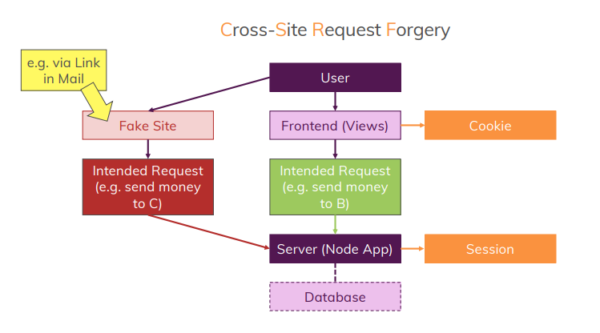

# Security (보안)

### Cross-Site Scripting Attacks (XSS)

웹 애플리케이션에서 많이 나타나는 취약점의 하나로 웹사이트 관리자가 아닌 사용자가 웹페이지에 악성 스크립트를 삽입하는 것이다.

XSS 예시는 다음과 같다.

```html
<input id='input'></input>
<button id='input-btn'>submit</button>

<div id='submitted-input'></div>
```

```jsx
document.querySelector('#input-btn').addEventListener("click", (e) => {
  const userInput = document.querySelector('#input').value

  document.querySelector('#submitted-input').innerHTML = userInput
})
```

사용자가 입력폼에 스크립트 코드를 입력하면 스크립트 내용이 DOM에 추가된다.

위의 input에  와 같은 코드를 입력하면 창이 뜨는 것을 볼 수 있다.

XSS를 방지하는 방법

1. innerHTML 대신에 contentText를 사용하는 방식으로 구현한다.
2. sanitize-html를 사용하여 악성 스크립트를 제거한다.

    ```powershell
    > npm install sanitize-html
    ```

    ```jsx
    const sanitizeHtml = require("sanitize-html");
    
    const text = `스크립트  / h1태그 <h1>제목</h1>`;
    const clean = sanitizeHtml(text);
    
    console.log(clean); //스크립트  / h1태그 <h1>제목</h1>
    ```

   node app.js를 터미널에 입력하면 스크립트 태그를 제외하고 실행 되는 것을 볼 수 있다.

3. 라이브러리는 프로젝트 코드 안에 추가되는 것이므로 타사 라이브러리를 사용할 때 해당 라이브러리가 보안에 취약한 지 판단하여 적용한다.

<br>

### Cross-Site Request Forgery (CSRF)

CORS는 크로스 사이트 요청 위조의 축약어이다.

사람들을 속여서 링크를 클릭하여 준비된 페이지로 유도하는 것이다.

해당 페이지에서 로컬 쿠키를 악용하여 통신하는 페이지에 요청을 보낸다.

**CSRF 동작 원리**

CSRF가 성공하려면 아래 3가지 조건이 만족해야 한다.

1. 사용자는 보안이 취약한 서버로부터 이미 로그인되어있는 상태여야 한다.
2. 쿠키 기반의 세션 정보를 획득할 수 있어야 한다.
3. 공격자는 서버를 공격하기 위한 요청 방법에 대해 파악하고 있어야 한다.

이 조건이 만족된다면 아래와 같은 과정을 통해 공격할 수 있다.

1. 사용자가 보안이 취약한 서버에 로그인한다.
2. 서버에 저장된 세션을 사용할 수 있는 session ID가 사용자의 브라우저 쿠키에 저장된다.
3. 공격자는 사용자가 악성 스크립트를 누르도록 유도한다.

   악성 스크립트 유도 방식

    - 게시판이 있는 웹 사이트에 악성 스크립트를 게시글로 작성하여 사용자들이 게시글을 클릭하도록 유도
    - 메일 등으로 악성 스크립트를 직접 전다라헉나, 악성 스크립트가 적힌 페이지 링크 전달
4. 사용자가 악성 스크립트가 작성된 페이지 접근 시 웹 브라우저에 의해 쿠키에 저장된 session ID와 함께 서버로 요청된다.
5. 서버는 쿠키에 담긴 session ID를 통해 해당 요청이 인증된 사용자로부터 온 것으로 판단하고 처리한다.


<br><br>

### Cross-Origin Resource Sharing (CORS)

웹 생태계가 다양해지면서 다른 사이트간에 데이터를 주고받아질 필요가 생겼고

다른 출처(웹사이트 - API 주소)간에 리소스를 공유할 수 있도록 하는 CORS가 나타났다.

CORS는 `Protocal, Host, Port` 3가지가 동일한지 판단한다.

ex) `https://evan-moon.github.io`

| URL | 결과 | 이유 |
| --- | --- | --- |
| `https://beomy.github.io/about` | 같은 출처 | Protocal, Host, Port 동일 |
| `https://beomy.github.io/about?q=work` | 같은 출처 | Protocal, Host, Port 동일 |
| `https://beomy.github.io/about#work` | 같은 출처 | Protocal, Host, Port 동일 |
| `http://beomy.github.io` | 다른 출처 | Protocal 다름 |
| `https://beomy.github.io:81/about` | 다른 출처 | Port 다름 |
| `https://beomy.heroku.com` | 다른 출처 | Host 다름 |