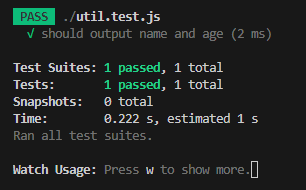

# Testing

## 유닛 테스트

유닛 테스트는 컴퓨터 프로그래밍에서 소스 코드의 특정 모듈이 의도된 대로 정확히 작동하는지 검증하는 절차이다. 즉, 모든 함수와 메소드에 대한 테스트 케이스(Test case)를 작성하는 절차를 말한다. 이를 통해서 언제라도 코드 변경으로 인해 문제가 발생할 경우, 단시간 내에 이를 파악하고 바로 잡을 수 있도록 해준다.

<br>

**유닛 테스트 방법**

여기서는 Jset를 사용하여 테스트를 진행한다.

Jest는 페이스북팀에서 Jasmine 기반으로 만든 테스팅 프레임워크이다.

1. 설치 & 코드 작성

    ```powershell
    > npm i --save-dev jest
    ```

    ```jsx
    //util.js
    exports.generateText = (name, age) => {
      // Returns output text
      return `${name} (${age} years old)`;
    };
    ```

2. 테스트 코드 작성

    ```jsx
    //util.test.js
    const { generateText } = require("./util");
    
    //아래는 Jest에서 지원하는 구문이 아니다.
    //import { generateText } from "./util";
    
    test("should output name and age", () => {
      const text = generateText("Max", 29);
      expect(text).toBe("Max (29 years old)");
      const text2 = generateText("", null);
      expect(text2).toBe(" (null years old)");
      const text3 = generateText();
      expect(text3).toBe("undefined (undefined years old)");
    });
    ```

   **JEST API 설명**

    - test()는 새로운 테스트 케이스를 만드는 함수
    - expect()는 특정 값을 정의하고 통과 하면 테스트를 성공시키고 통과하지 못하면 실패시킴
    - toBe()는 특정 조건이 어떤 조건을 만족하는지, 어떤 함수가 실행이 되었고 에러가 났는지 등을 확인
3. jest 실행

    ```json
    //package.json
    "scripts": {
      "test": "jest --watchAll"
    },
    ```

   watchAll을 붙일 경우 계속 감시하여 테스트를 할 수 있다.

    ```powershell
    > npm test
    ```

   이와 같이 입력하여 실행하면 테스트가 정상적으로 수행되고 결과물이 나온다.

    

<br>

## 통합 테스트

통합 테스트란 모듈을 통합하는 단계에서 수행하는 테스트로, Unit Test를 통해 각 모듈들이 잘 작동되는 것을 확인했다면 이제 각 모듈들을 연동해서 테스트를 수행해야하는데, 이를 통합 테스트라고 한다.

**통합 테스트를 하는 이유**

1. 모듈들의 상호 작용이 잘 이루어지는지 검증하기 위해
2. 통합하는 과정에서 발생할 수 있는 오류를 찾기 위해

**통합 테스트 코드 예시**

```jsx
//util.js
exports.generateText = (name, age) => {
  // Returns output text
  return `${name} (${age} years old)`;
};

const validateInput = (text, notEmpty, isNumber) => {
  // Validate user input with two pre-defined rules
  if (!text) {
    return false;
  }
  if (notEmpty && text.trim().length === 0) {
    return false;
  }
  if (isNumber && +text === NaN) {
    return false;
  }
  return true;
};

exports.checkGenerate = (name, age) => {
  if (!validateInput(name, true, false) || !validateInput(age, false, true)) {
    return false;
  }
  return this.generateText(name, age);
};
```

```jsx
//util.test.js
const { checkGenerate } = require("./util");

test("should generate a valid text output", () => {
  const text = checkGenerate("Max", 29);
  expect(text).toBe("Max (29 years old)");
});
```

<br>

## E2E 테스트 & 사용자 인터페이스 테스트

E2E 테스트(end-to-end-test)는 실제 사용자의 실행 환경과 거의 동일한 환경에서 테스트를 진행한다. 이런 성격으로 기능테스트 혹은 UI 테스트라고도 불린다. 자바스크립트의 api만으로는 제어할 수 없는 행위 예를 들어 브라우저 크기 변경, 실제 키보드 입력 등을 테스트 할 수 있다.

여기서는 puppeteer를 사용해 테스트를 진행한다.

1. 설치 & 코드 작성

    ```powershell
    > npm i --save-dev puppeteer
    ```

    ```html
    <section class="control-panel">
        <div class="input-container">
            <label for="name">Name</label>
            <input type="text" id="name">
        </div>
        <div class="input-container">
            <label for="age">Age</label>
            <input type="number" id="age">
        </div>
        <button id="btnAddUser" class="button">Add User</button>
    </section>
    <hr>
    <section class="user-output">
        <ul class="user-list"></ul>
    </section>
    ```

    ```jsx
    //app.js
    const { createElement, checkGenerate } = require("./util");
    
    const initApp = () => {
      // Initializes the app, registers the button click listener
      const newUserButton = document.querySelector("#btnAddUser");
      newUserButton.addEventListener("click", addUser);
    };
    
    const addUser = () => {
      // Fetches the user input, creates a new HTML element based on it
      // and appends the element to the DOM
      const newUserNameInput = document.querySelector("input#name");
      const newUserAgeInput = document.querySelector("input#age");
    
      const outputText = checkGenerate(
        newUserNameInput.value,
        newUserAgeInput.value
      );
    
      if (!outputText) return;
    
      const userList = document.querySelector(".user-list");
    
      const element = createElement("li", outputText, "user-item");
      userList.appendChild(element);
    };
    
    // Start the app!
    initApp();
    ```

    ```jsx
    //util.js 상단 코드 참고
    ...
    
    exports.createElement = (type, text, className) => {
      // Creates a new HTML element and returns it
      const newElement = document.createElement(type);
      newElement.classList.add(className);
      newElement.textContent = text;
      return newElement;
    };
    ```

2. 테스트 코드 작성

    ```jsx
    //util.test.js
    const puppeteer = require("puppeteer");
    
    test("should create an element with and correct class", async () => {
      const browser = await puppeteer.launch({
        //옵션, 브라우저 설정
        headless: true,
        // slowMo: 80,
        // args: ["--window-size=1920,1080"],
      });
      const page = await browser.newPage();
      await page.goto("file:///C:/Users/name/Desktop/testing/index.html");
    
      await page.click("input#name");
      await page.type("input#name", "Anna");
      await page.click("input#age");
      await page.type("input#age", "28");
      await page.click("#btnAddUser");
      const finalText = await page.$eval(".user-item", (el) => el.textContent);
      expect(finalText).toBe("Anna (28 years old)");
    }, 10000);
    ```

   **puppeteer API 설명**

    - page.goto(url, options)는 url로 페이지를 이동함
    - page.$eval(selector, pageFunction)은 원하는 결과값만 반환하도록 할 수 있음
    - page.click(selector)은 selector에 맞는 엘리먼트를 찾고 엘리먼트를 클릭함
    - page.type(selector, value)은 selector에 맞는 엘리먼트를 찾고 값을 넣어 줌