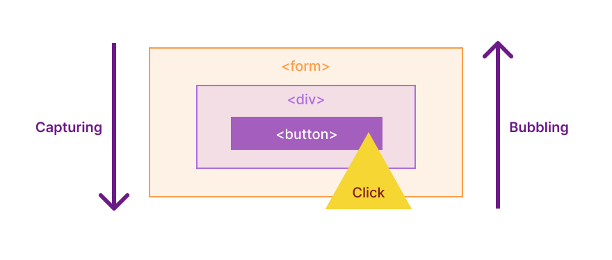

# Bubbling & Capturing



## 버블링

한 요소에 이벤트가 발생하면 이 요소에 할당된 핸들러가 동작하고 이어서 부모 요소의핸들러가 동작한다.

가장 최상단의 조상 요소를 만날 때까지 이 과정이 반복되면서 요소 각각에 할당된 핸들러가 동작한다.

```html
<form onclick="alert('form')">FORM
  <div onclick="alert('div')">DIV
    <p onclick="alert('p')">P</p>
  </div>
</form>
```

가장 안쪽의 `<p>`를 클릭하면 다음과 같이 실행된다.

1. <p>에 할당된 onclick 핸들러가 동작
2. 바깥의 `<div>`에 할당된 핸들러가 동작
3. 그 바깥의 `<form>`에 할당도니 핸들러가 동작
4. document 객체를 만날 때까지, 각 요소에 할당된 onclick 핸들러가 동작

이런 이유로 `<p>` 요소를 클릭하면 p → div → form 순서로 3개의 얼럿 창이 뜨게 된다.

## 캡처링

캡처링 단계는 이벤트 버블링과 반대 방향으로 진행되는 이벤트 전파 방식이다.

캡처링을 이용하는 경우는 흔치 않기 떄문에 캡쳐링에 대한 코드를 발견하는 일은 거의 없다.