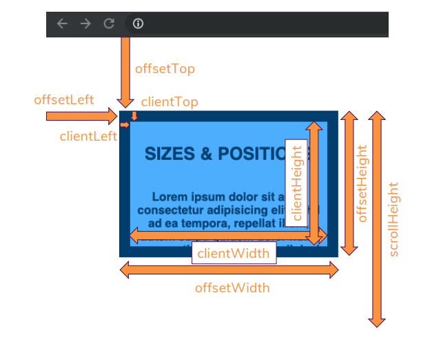

# DOM

## DOM 요소 크기

$0 : 크롬 개발자 도구에서 지원하는 기능으로 현재 마우스로 선택된 범위를 지정함

### ✅ Sizes & Positiions



<br>

## &lt;Template&gt; 태그

template 요소는 페이지를 불러온 순간 즉시 그려지지는 않지만, DOM에 포함된다.

```html
<template id="tooltip">
		<h2>Warning</h2>
    <p></p>
</template>
<div id="target">
	...
</div>
```

```jsx
const target = document.getElementById('target');
const tooltipTamplate = document.getElementById('tooltip');
const tooltipBody = document.importNode(tooltipTamplate.content, true);
tooltipBody.querySelector('p').textContent = '접근할 수 없습니다.'
target.append(tooltipBody)
```

위 코드를 실행하면 template 태그의 내용이 문서에 출력된다. 이는 script에서 template의 태그를 활성화(importNode) 시켜주었기 때문이다.

### ✅ importNode 설명

```jsx
Document.importNode(externalNode, deep)
```

importNode는 현재 문서가 아닌 외부 문서의 노드를 복사하여 현재 문서에 넣을 수 있게 해주는 메소드이다.

externalNode는 다른 문서에서 가져올 노드이고, deep은 boolean 타입을 가지는데 가져올 노드의 자식 요소들을 포함하여 가져올 것인지 여부를 나타낸다.