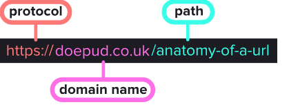

# WEB

## URL

- protocol : 컴퓨터와 서버가 통신하는데 사용되는 프로토콜
- domain name : 사람이 읽을 수 있는 웹사이트 주소이자 웹 사이트를 식별하는 장치
- path : 경로를 의미하며 웹사이트의 특정 리소스와 특정 페이지에 대한 포인터 역할을 함

 

## 웹 작동 방식

1. 도메인을 입력하면 DNS(Domain name system) 서버가 IP 주소로 변환해준다.
2. 변환받은 IP 주소를 웹사이트 서버로 보낸다.

### ✅ www

www은 월드 와이드 웹이라고 한다. 
www.amazon.com은 루트 도메인이라 부르며 amazon.com은 하위 도메인이라 부른다.

 

## 브라우저 정보 및 위치

### ✅ location

| Property | Description | Example |
| --- | --- | --- |
| hash | 주소값에 붙어있는 anchor값 반환 | #test |
| host | URL의 도메인과 포트 반환 | www.naver.com:8080 |
| hostname | URL의 도메인 반환 | www.naver.com |
| href | URL 반환 | http://www.naver.com:8080/search?q=devmo#test |
| origin | 프로토콜 + URL의 도메인 + 포트 | http://www.naver.com:8080 |
| pathname | URL 경로 반환 | /search |
| port | 서버포트 반환 | 8080 |
| protocol | 프로토콜 반환 | http: |
| search | URL에 붙은 매개변수 반환(물음표 뒤의 값) | ?q=devmo |

### ✅ history

| Property | Description |
| --- | --- |
| back() | 뒤로 이동 |
| forward() | 앞으로 이동 |
| go() | 숫자만큼 이동 (음수 = 뒤로, 양수 = 앞으로) |

### ✅ navigator

| Property | Description | Example |
| --- | --- | --- |
| appCodeName | 브라우저의 코드명을 반환합니다. | Mozilla’ |
| appName | 브라우저의 이름을 반환합니다. | Netscape |
| appVersion | 브라우저의 버전을 반환합니다. | 5.0 (Windows NT 10.0; Win64; x64) AppleWebKit/537.36 (KHTML, like Gecko) Chrome/113.0.0.0 Safari/537.36 |
| cookieEnabled | 브라우저의 쿠키 사용 가능 여부를 반환합니다. | true |
| language | 브라우저에서 사용되는 언어를 반환합니다. | ko-KR |
| onLine | 브라우저가 온라인인지 여부를 반환합니다. | true |
| platform | 브라우저가 실행되는 플랫폼 정보를 반환합니다. | Win32 |
| product | 브라우저에서 사용되는 엔진 이름을 반환합니다. | Gecko |
| userAgent | 브라우저와 운영체제 정보를 반환합니다. | Mozilla/5.0 (Windows NT 10.0; Win64; x64) AppleWebKit/537.36 (KHTML, like Gecko) Chrome/113.0.0.0 Safari/537.36 |