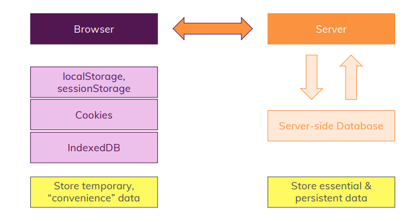

## Browser Storage



<br>

### localStorage / sessionStorage

단순히 키-값 쌍인 저장소이다.

보통 로컬 스토리지는 사용자 설정이나 기본 사용자 데이터(예를 들어 사용자의 세션 ID)를 관리한다.

로컬 스토리지는 자바스크립트만 사용해야 통신이 가능하다.

세션 스토리지 데이터는 브라우저에서 페이지가 열려 있는 동안 남아있고 페이지를 닫으면 지워진다.

로컬 스토리지는 사용자가 수동으로 삭제하지 않는 한 데이터가 남아있다.

```jsx
const user = {
  id: "abc1",
  name: "Max",
  age: 30,
};

//로컬 스토리지 저장
localStorage.setItem("user", JSON.stringify(user));

//저장된 로컬스토리지에서 가져오기
let extractedId = JSON.parse(localStorage.getItem("user"));
console.log(extractedId); //{id: 'abc1', name: 'Max', age: 30}

//세션 스토리지 저장
sessionStorage.setItem("user", JSON.stringify(user));
```

<br>

### Cookies

키-값 쌍이지만 만료일을 구성할 수 있다.

유저의 기본 설정, 세션 ID 등을 관리하는 데 사용한다.

자바스크립트로 엑세스하고 지울 수 있다.

쿠키는 로컬 스토리지와 다르게 웹 페이지가 실제 서버로 제공되는 경우만 사용 가능하다.

때문에 쿠키를 저장하기 위해 터미널에서 [serve](https://www.npmjs.com/package/serve) 를 실행시켜야 한다.

```jsx
const userId = "u123";
const user = { name: "Max", age: 30 };
//교체가 아닌 추가
document.cookie = `uid=${userId}; max-age=360`;
document.cookie = `user=${JSON.stringify(user)}`;

const cookieData = document.cookie.split(";");
const data = cookieData.map((i) => i.trim());
console.log(data); //['user={"name":"Max","age":30}', 'uid=u123']
```

<br>

### IndexedDB

클라이언트 측 데이터베이스이며 브라우저에 빌트인 되어 있어 쿼리 언어를 사용할 수 있는데 복잡한 데이터를 관리할 수 있다. 연결된 레코드가 있는 다양한 테이블이 있고 자바스크립트로 엑세스, 삭제가 가능하다.

복잡하지만 중요하지 않은 데이터를 관리할 때 유용하다.

```jsx
const dbRequest = indexedDB.open("StroageDummy", 1);
let db;

//데이터 추가할 시 업데이트
dbRequest.onsuccess = function (e) {
  db = e.target.result;
};

//데이터베이스가 처음 만들어질 때 또는 버전이 변경될 때 실행
dbRequest.onupgradeneeded = function (e) {
  db = e.target.result;
  const objStore = db.createObjectStore("products", { keyPath: "id" });
  objStore.transaction.oncomplete = function (e) {
    const productsStore = db
      .transaction("products", "readwrite")
      .objectStore("products");

    productsStore.add({
      id: "p1",
      title: "A First Product",
      price: 12.99,
      tags: ["Expensive", "Easy"],
    });
  };
};

//데이터 추가
setTimeout(() => {
  const productsStore = db
    .transaction("products", "readwrite")
    .objectStore("products");

  productsStore.add({
    id: "p2",
    title: "A Secound Product",
    price: 12.99,
    tags: ["Expensive", "Easy"],
  });
}, 1000);

//데이터 출력
setTimeout(() => {
  const productsStore = db
    .transaction("products", "readwrite")
    .objectStore("products");

  const request = productsStore.get("p2");
  request.onsuccess = function () {
    console.log(request.result);
  };
}, 2000);

dbRequest.onerror = function (e) {
  console.log("ERROR!");
};
```