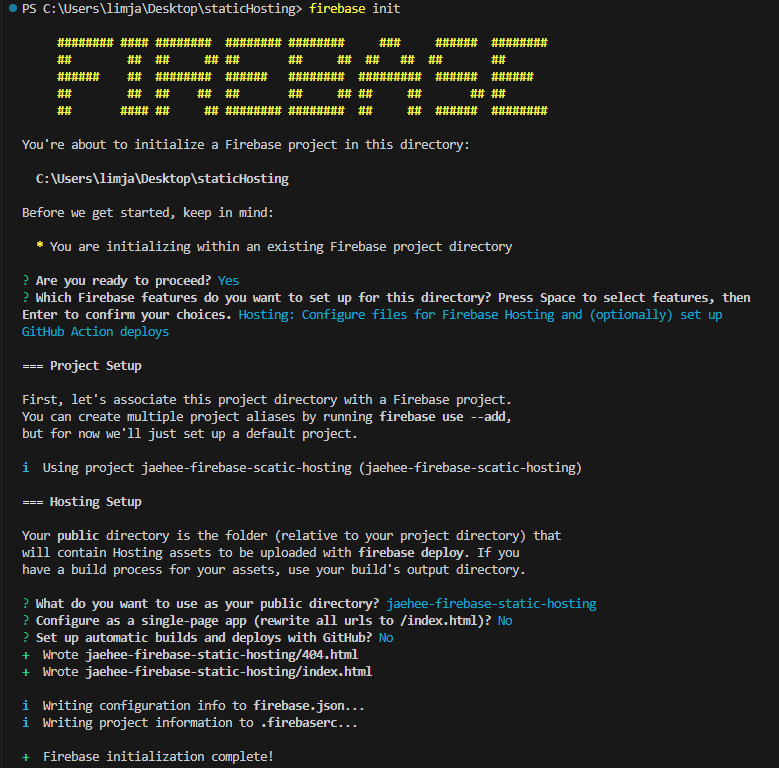

# Deploy

## 웹 사이트 유형

1. (HTML + CSS + JS만 있는) 정적 웹사이트
2. 단일 페이지 애플리케이션
   (SPA, HTML + CSS + JS는 단 하나의 HTML 페이지만 제공되고 클라이언트 측 JS는 페이지를 동적으로 다시 렌더링하는 데 사용됩니다)
3. 동적으로/서버 측에서 렌더링된 웹 애플리케이션.
   HTML 페이지가 서버에서 동적으로 생성되는 웹사이트
   (예: EJS와 같은 템플릿 엔진을 통해 만들어지는 웹사이트).

## 정적 호스트 배포

파이어베이스 배포를 하기 위해서 우선 빌드를 하여 배포를 위한 dist 폴더를 생성한다.

```powershell
> npm run build
```

파이어베이스 프로젝트를 생성해준다.

firebase init을 하면 .firebaserc와 firebase.json 파일이 생성되는데 여기서 호스팅 설정을 할 수 있다.

```powershell
> firebase init

// 여기서 로그인이 되지 않았다고 하면 아래를 입력하여 로그인해준다.
> firebase login
```




firebase deploy를 실행하여 dist를 firebase 서버에 업로드 하고 프로젝트를 배포한다.

```powershell
> firebase deploy
```

<br>

## 동적 호스트 배포

Heroku 로그인 후 새로운 프로젝트 생성 - Heroku CLI 페이지로 이동하여 CLI를 설치한다.

그 다음 프로젝트 터미널을 열어 로그인해준다.

```powershell
> heroku login
```

깃 레퍼지토리를 등록해준다

```powershell
> git init
> heroku git:remote -a project
```

현재 프로젝트를 배포한다

```powershell
> git add .
> git commit -am "make it better"
> git push heroku master
```